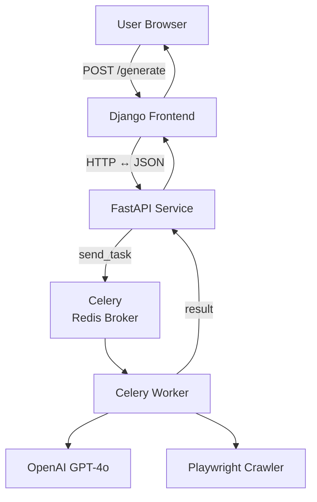

## Introduction

In this follow-up post I'll lift the hood on **CVFactory's** backend ‑ the directory you can find at `@/Backend` in the repo.

The service may look small, but it orchestrates a surprising amount of moving parts:

* **FastAPI** for a thin HTTP interface
* **Celery** for asynchronous, fault-tolerant job queues
* **Playwright** for scraping job descriptions that hide behind login walls
* **LangChain** for prompt templating and LLM orchestration
* **Docker + Supervisord** to bundle everything into a single, reproducible container

My goal is to share the design decisions, code snippets, and gotchas so that you can reuse or extend the pattern in your own projects.

### 1. Why split the backend from Django?

Django excels at session-based web apps, but long-running AI calls and headless browser automation can block the asyncio loop and exhaust Gunicorn workers. Off-loading these tasks to a **dedicated FastAPI + Celery stack** keeps the main web app snappy and horizontally scalable.

### 2. Task pipeline in depth

1. **`extract_html.py`** — Given a URL, spin up a Playwright context, authenticate if needed, and extract the raw HTML.
2. **`text_extraction.py`** — Clean the HTML with `BeautifulSoup` and remove boilerplate like nav bars.
3. **`content_filtering.py`** — Apply a profanity filter and redact PII (Personally Identifiable Information).
4. **`cover_letter_generation.py`** — Build a prompt, call the LLM, and stream tokens back to the client.

Each step is **idempotent** and logged to `/Backend/logs` so that reruns don't re-crawl the same page unnecessarily.

  <pre class="language-python line-numbers" tabindex="0"><code class="language-python"># tasks/cover_letter_generation.py (snippet)
from celery import shared_task
from utils.logging_utils import task_logger
from utils.celery_utils import get_openai_client

@shared_task(bind=True, acks_late=True, autoretry_for=(Exception,), retry_backoff=True)
def generate_cover_letter(self, clean_text: str, profile: dict) -> str:
    """Generates a cover-letter draft from sanitized JD + user profile."""
    task_logger.info("Starting generation task", extra={"task_id": self.request.id})

    client = get_openai_client()
    prompt = _build_prompt(clean_text, profile)
    response = client.chat.completions.create(model="gpt-4o", messages=prompt)

    task_logger.info("LLM finished", extra={"usage": response.usage})
    return response.choices[0].message.content</code></pre>
  
PYTHON

  

    Copied
    <button class="copy-clipboard">
      <svg xmlns="http://www.w3.org/2000/svg" height="24px" viewBox="0 -960 960 960" width="24px" fill="#202124"><path d="M360-240q-33 0-56.5-23.5T280-320v-480q0-33 23.5-56.5T360-880h360q33 0 56.5-23.5T800-800v480q0 33-23.5-56.5T720-240H360Zm0-80h360v-480H360v480ZM200-80q-33 0-56.5-23.5T120-160v-560h80v560h440v80H200Zm160-240v-480 480Z"></path></svg>
    </button>
  

  

    <button class="dark-mode-toggle">
      <svg xmlns="http://www.w3.org/2000/svg" height="24px" viewBox="0 -960 960 960" width="24px" fill="#202124"><path d="M480-120q-150 0-255-105T120-480q0-150 105-255t255-105q14 0 27.5 1t26.5 3q-41 29-65.5 75.5T444-660q0 90 63 153t153 63q55 0 101-24.5t75-65.5q2 13 3 26.5t1 27.5q0 150-105 255T480-120Zm0-80q88 0 158-48.5T740-375q-20 5-40 8t-40 3q-123 0-209.5-86.5T364-660q0-20 3-40t8-40q-78 32-126.5 102T200-480q0 116 82 198t198 82Zm-10-270Z"></path></svg>
    </button>
  

### 3. Robust logging & error handling

Every function is wrapped with **structured logging** and **granular exception catching** so that a failure in Playwright doesn't bring down the entire worker. Logs are shipped to CloudWatch in production and to files locally.

* Use `retry_backoff=True` to add exponential retries for transient errors.
* Capture full tracebacks but redact sensitive env vars before shipping logs.

### 4. Local development in one command

  <pre class="language-bash line-numbers" tabindex="0"><code class="language-bash">docker compose -f docker-compose.yml up --build --remove-orphans</code></pre>
  
BASH

  

    Copied
    <button class="copy-clipboard">
      <svg xmlns="http://www.w3.org/2000/svg" height="24px" viewBox="0 -960 960 960" width="24px" fill="#202124"><path d="M360-240q-33 0-56.5-23.5T280-320v-480q0-33 23.5-56.5T360-880h360q33 0 56.5-23.5T800-800v480q0-33-23.5-56.5T720-240H360Zm0-80h360v-480H360v480ZM200-80q-33 0-56.5-23.5T120-160v-560h80v560h440v80H200Zm160-240v-480 480Z"></path></svg>
    </button>
  

  

    <button class="dark-mode-toggle">
      <svg xmlns="http://www.w3.org/2000/svg" height="24px" viewBox="0 -960 960 960" width="24px" fill="#202124"><path d="M480-120q-150 0-255-105T120-480q0-150 105-255t255-105q14 0 27.5 1t26.5 3q-41 29-65.5 75.5T444-660q0 90 63 153t153 63q55 0 101-24.5t75-65.5q2 13 3 26.5t1 27.5q0 150-105 255T480-120Zm0-80q88 0 158-48.5T740-375q-20 5-40 8t-40 3q-123 0-209.5-86.5T364-660q0-20 3-40t8-40q-78 32-126.5 102T200-480q0 116 82 198t198 82Zm-10-270Z"></path></svg>
    </button>
  

### 5. Lessons learned

* **Keep tasks small & serializable** — Pass only JSON-serializable payloads to Celery.
* **Don't scrape inside the web worker** — Off-load any I/O-heavy scraping to dedicated workers to avoid timeouts.
* **Leverage typed settings** — `pydantic.BaseSettings` in `core/config.py` catches mis-configured env vars at startup.

### Closing thoughts

The Backend may sit quietly behind the scenes, but it enables the AI magic users see on the frontend. By modularizing each concern—HTTP I/O, task queuing, scraping, and LLM calls—you gain a pipeline that's easier to observe, scale, and extend.

Have questions or ideas? Feel free to open an issue or PR. Happy hacking! 