## Introduction

While adding features like a **hamburger menu, OAuth login, and per-user settings** to a side project, I started to feel the limits of plain HTML/CSS/JavaScript (hereafter *vanilla JS*). As stateful widgets multiplied, so did the DOM spaghetti. That raised the million-dollar question:

> "Should I adopt Svelte (or SvelteKit), or keep pushing with vanilla JS?"

Based on a lengthy internal discussion (see `7.1.md`), this post distills a **hands-on checklist** for balancing framework benefits against resource constraints.

---

### 1. When did I actually need a framework?

| Requirement | Pain with vanilla JS | Svelte (Kit) advantage |
|-------------|----------------------|------------------------|
| Shared state across multiple components | Long `querySelector` chains & ad-hoc event buses | `$:` reactivity, Stores for global state |
| Client-side routing (SPA feel) | Must hand-roll History API logic | File-based routing built-in |
| SEO + SSR | Django template handles SSR, but JS widgets ship as empty `<div>` | SvelteKit server-side render & prerender |
| Bundle optimization | Manual Webpack/Vite tuning | Vite-powered build & code splitting by default |
| Team & feature growth | No conventions → onboarding cost ↑ | Component/file conventions baked in |

> **TL;DR** — The more shared state, reusable components, and SEO you need, the faster SvelteKit pays for itself.

---

### 2. Risks of staying vanilla

1. **DOM spaghetti** — tracking who mutates the DOM becomes a nightmare.
2. **State desync bugs** — login/logout, dark-mode toggles, etc. easily drift.
3. **Testing overhead** — E2E tests require verbose DOM selectors.
4. **Bundle fatigue** — every new page demands manual caching & split-chunk tweaks.

---

### 3. Option comparison

```mermaid
flowchart LR
  subgraph "👟 Vanilla JS"
    A1[HTML Template] -->|DOM manip| A2[script.js]
  end
  subgraph "🧩 Svelte Components"
    B1[Django Template] --> B2[<script src="build.js">]
    B2 --> B3[Svelte Widget]
  end
  subgraph "🚀 SvelteKit + API"
    C1[SvelteKit SSR] -->|REST| C2[Django API]
  end
```



| Model | Pros | Cons |
|-------|------|------|
| **Vanilla JS** | No Node runtime → low memory | Must implement state & routing yourself |
| **Svelte Components** | Drop-in interactive widgets | Full page reload between Django views |
| **SvelteKit** | SPA feel **and** SSR/SEO | Extra Node server to operate |

---

### 4. A Python-first, resource-minimal architecture

> Assumptions: SEO/GEO only mattered for the landing page, I was on Northflank's free tier, and I prefer Python-centric ops.

1. **Backend** — Django (templates + REST API)
2. **Frontend**
   * Landing page: Django template with SEO meta tags
   * Dashboard & settings: Svelte bundle served as static assets
3. **Build pipeline (multi-stage Docker)**
   ```bash
   FROM node:20 AS client-build
   WORKDIR /app
   COPY frontend/ .
   RUN npm ci ; npm run build

   FROM python:3.11-slim AS runtime
   WORKDIR /srv
   COPY --from=client-build /app/build/ /srv/static/
   COPY requirements.txt . ; pip install --no-cache-dir -r requirements.txt
   COPY . /srv
   CMD gunicorn config.wsgi --bind 0.0.0.0:$PORT
   ```
   → The **runtime image** ships with *no* Node binary, trimming RAM usage.

---

### 5. Cloudflare Worker BFF & Edge Caching

> I needed to hide API keys and off-load traffic without burning my free Northflank quota, so I put a tiny **Cloudflare Worker** in front of the API.


Key points:

* **Security** — API keys live in Worker secrets; never reach the browser.
* **Speed** — `cf: { cacheTtl: 60 }` caches JSON at 300+ global edges.
* **Cost** — Workers Free plan → 2.5 M requests/mo at zero dollars.

```js
// cf-worker.js (snippet)
export default {
  async fetch(request, env) {
    if (request.method === 'OPTIONS') {
      return new Response(null, { status: 204, headers: { 'Access-Control-Allow-Origin': '*', ... } });
    }

    const api = new URL(env.UPSTREAM_URL);
    api.pathname = '/v1/orders';
    api.search = new URL(request.url).search;

    const upstream = await fetch(api, {
      headers: { 'X-API-KEY': env.API_KEY },
      cf: { cacheTtl: 60, cacheEverything: true }
    });

    const res = new Response(upstream.body, upstream);
    res.headers.set('Access-Control-Allow-Origin', '*');
    return res;
  }
};
```

---

### 6. Dev Container workflow

> "It works on my machine" is usually a **Docker-image mismatch** problem. Developing **inside the very same container** I push to Northflank eliminates that class of bugs.

#### Why bother?

* **Zero env drift** — VS Code (or Codespaces) launches inside the runtime image you deploy, so Python, Node, OS libs all match production bits.
* **Instant reload** — Source is bind-mounted; Django autoreload & Vite HMR trigger on save.
* **First-class debugging** — VS Code Python debugger and Svelte Inspector attach straight to container PIDs.
* **One-shot onboarding** — New contributor: `F1 ▸ Dev Containers: Reopen in Container` → ready in minutes.

#### Minimal setup

1) `.devcontainer/devcontainer.json`
```jsonc
{
  "name": "myapp-dev",
  "dockerComposeFile": ["../docker-compose.dev.yml"],
  "service": "web",                  // Django container
  "workspaceFolder": "/srv",
  "shutdownAction": "stopCompose",
  "extensions": [
    "ms-python.python",
    "ms-python.vscode-pylance",
    "esbenp.prettier-vscode",
    "dbaeumer.vscode-eslint"
  ],
  "postCreateCommand": "pip install -r requirements.txt"
}
```

2) `docker-compose.dev.yml`
```yaml
version: "3.9"
services:
  web:
    build:
      context: .
      target: runtime          // reuse prod runtime stage
    command: python manage.py runserver 0.0.0.0:8000
    volumes:
      - ..:/srv                // live code mount
    ports:
      - "8000:8000"
    env_file: .env.dev

  client:
    build:
      context: ./client
      dockerfile: Dockerfile.dev
    command: npm run dev -- --host
    volumes:
      - ../client:/app
    ports:
      - "5173:5173"
```

3) `client/Dockerfile.dev`
```dockerfile
FROM node:20
WORKDIR /app
COPY package*.json ./
RUN npm install --legacy-peer-deps
CMD ["npm", "run", "dev", "--", "--host"]
```

#### Tips & caveats

| Tip | Reason |
|-----|--------|
| Re-use `runtime` stage | Guarantees 100 % parity with Northflank image |
| Mount only source, not `node_modules` | Keeps host-container I/O light |
| First open can be slow | Container image pulls & installs once |
| Keep `forwardPorts` in `devcontainer.json` | So Codespaces auto-exposes 8000 / 5173 |

---

### 7. CI/CD & Deployment Flow

1. **Local commit**
   ```bash
   git add . ; git commit -m "feat: landing SEO + CF worker" ; git push origin develop
   ```
2. **Northflank pipeline**
   * Auto-detects push, builds multi-stage Dockerfile, deploys container.
3. **Optional manual deploy**
   ```bash
   docker build -t myapp:latest .
   docker push myrepo/myapp:latest ; nf deploy myapp
   ```
4. **Cloudflare Worker**
   ```bash
   wrangler publish --env production
   ```

---

### 8. Resource-saving levers

| Lever | Why it helps |
|-------|--------------|
| Drop Node at runtime | ~100 MB RAM saved; fewer CVEs to watch |
| Edge cache JSON & static assets | Django handles fewer requests; lower CPU quota |
| LocMemCache → Redis add-on (later) | Start cheap, scale only when needed |
| Multi-stage Docker | Final image < 200 MB, faster cold start |

---

### 9. Future roadmap

* **UI complexity ↑** → Switch to `SvelteKit adapter-static`, still no Node server.
* **Real-time feed** → Add `Django Channels + Redis` or Server-Sent Events.
* **i18n & theming** → Use Svelte stores or `htmx` partial swaps.
* **Traffic spikes** → Scale Northflank replicas + tune Cloudflare cache TTL.

---

### 10. Decision checklist (quick recap)

- [ ] Will you exceed ~10 distinct pages?
- [ ] Do at least two places need shared global state (auth, theme, notifications)?
- [ ] Are most pages SEO-critical, or only the landing page?
- [ ] Can you afford to run and monitor an extra Node server?
- [ ] Does someone on the team already know a JS framework?

If you answer **yes** to **3 or more**, reach for SvelteKit. Otherwise, *vanilla JS + selective Svelte widgets* will likely suffice.

---

## Conclusion

Adopting a framework is **insurance against future tech debt**. Vanilla JS accelerates early momentum, but as features, team size, and SEO requirements grow, **maintenance cost skyrockets**.

Weigh today's needs against tomorrow's complexity to choose the **right moment** to migrate. A phased path—*Svelte widgets → SvelteKit*—remains totally valid.

> 💡 Tooling is secondary to the **value you ship** and your **team's productivity**. Pick what lets you move fastest *today* without boxing you in *tomorrow*. 