## Introduction

While adding features like a **hamburger menu, OAuth login, and per-user settings** to a side project, I started to feel the limits of plain HTML/CSS/JavaScript (hereafter *vanilla JS*). As stateful widgets multiplied, so did the DOM spaghetti. That raised the million-dollar question:

> "Should I adopt Svelte (or SvelteKit), or keep pushing with vanilla JS?"

Based on a lengthy internal discussion (see `7.1.md`), this post distills a **hands-on checklist** for balancing framework benefits against resource constraints.

---

### 1. When do you actually need a framework?

| Requirement | Pain with vanilla JS | Svelte (Kit) advantage |
|-------------|----------------------|------------------------|
| Shared state across multiple components | Long `querySelector` chains & ad-hoc event buses | `$:` reactivity, Stores for global state |
| Client-side routing (SPA feel) | Must hand-roll History API logic | File-based routing built-in |
| SEO + SSR | Django template handles SSR, but JS widgets ship as empty `<div>` | SvelteKit server-side render & prerender |
| Bundle optimization | Manual Webpack/Vite tuning | Vite-powered build & code splitting by default |
| Team & feature growth | No conventions → onboarding cost ↑ | Component/file conventions baked in |

> **TL;DR** — The more shared state, reusable components, and SEO you need, the faster SvelteKit pays for itself.

---

### 2. Risks of staying vanilla

1. **DOM spaghetti** — tracking who mutates the DOM becomes a nightmare.
2. **State desync bugs** — login/logout, dark-mode toggles, etc. easily drift.
3. **Testing overhead** — E2E tests require verbose DOM selectors.
4. **Bundle fatigue** — every new page demands manual caching & split-chunk tweaks.

---

### 3. Option comparison

```mermaid
flowchart LR
  subgraph "👟 Vanilla JS"
    A1[HTML Template] -->|DOM manip| A2[script.js]
  end
  subgraph "🧩 Svelte Components"
    B1[Django Template] --> B2[<script src="build.js">]
    B2 --> B3[Svelte Widget]
  end
  subgraph "🚀 SvelteKit + API"
    C1[SvelteKit SSR] -->|REST| C2[Django API]
  end
```



| Model | Pros | Cons |
|-------|------|------|
| **Vanilla JS** | No Node runtime → low memory | Must implement state & routing yourself |
| **Svelte Components** | Drop-in interactive widgets | Full page reload between Django views |
| **SvelteKit** | SPA feel **and** SSR/SEO | Extra Node server to operate |

---

### 4. A Python-first, resource-minimal architecture

> Assumptions: SEO/GEO only matters for the landing page, you're on Northflank's free tier, and you prefer Python-centric ops.

1. **Backend** — Django (templates + REST API)
2. **Frontend**
   * Landing page: Django template with SEO meta tags
   * Dashboard & settings: Svelte bundle served as static assets
3. **Build pipeline (multi-stage Docker)**
   ```bash
   FROM node:20 AS client-build
   WORKDIR /app
   COPY frontend/ .
   RUN npm ci ; npm run build

   FROM python:3.11-slim AS runtime
   WORKDIR /srv
   COPY --from=client-build /app/build/ /srv/static/
   COPY requirements.txt . ; pip install --no-cache-dir -r requirements.txt
   COPY . /srv
   CMD gunicorn config.wsgi --bind 0.0.0.0:$PORT
   ```
   → The **runtime image** ships with *no* Node binary, trimming RAM usage.

---

### 5. Decision checklist

- [ ] Will you exceed ~10 distinct pages?
- [ ] Do at least two places need shared global state (auth, theme, notifications)?
- [ ] Are most pages SEO-critical, or only the landing page?
- [ ] Can you afford to run and monitor an extra Node server?
- [ ] Does someone on the team already know a JS framework?

If you answer **yes** to **3 or more**, reach for SvelteKit. Otherwise, *vanilla JS + selective Svelte widgets* will likely suffice.

---

## Conclusion

Adopting a framework is **insurance against future tech debt**. Vanilla JS accelerates early momentum, but as features, team size, and SEO requirements grow, **maintenance cost skyrockets**.

Weigh today's needs against tomorrow's complexity to choose the **right moment** to migrate. A phased path—*Svelte widgets → SvelteKit*—remains totally valid.

> 💡 Tooling is secondary to the **value you ship** and your **team's productivity**. Pick what lets you move fastest *today* without boxing you in *tomorrow*. 