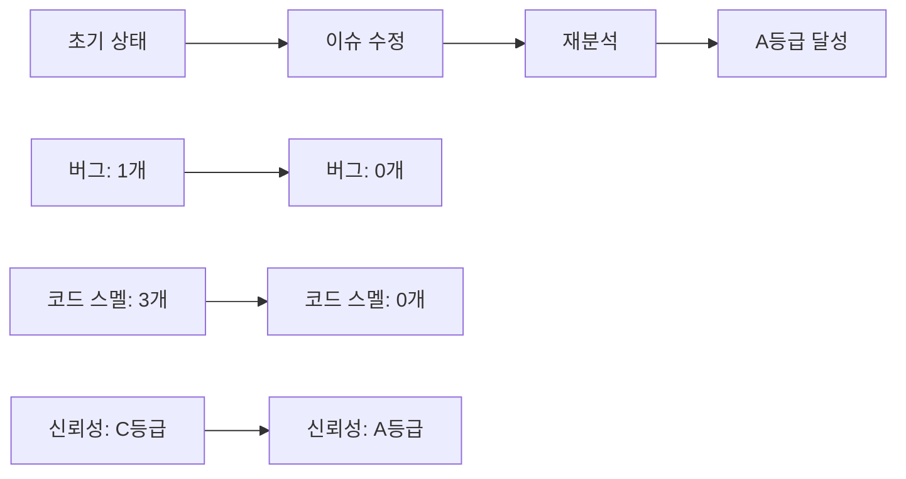
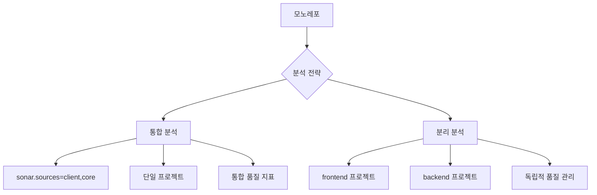

## Introduction

코드 품질 관리는 개발자에게 필수적인 요소다. 특히 **Svelte + Django 모노레포** 프로젝트에서 일관된 품질 기준을 유지하려면 정적 분석 도구가 필요하다. 이번 포스트에서는 SonarQube Community Edition을 로컬 환경에 구축하고, **버그 0개, A등급 품질**을 달성하는 과정을 공유한다.

> "코드 품질은 선택이 아닌 필수다. SonarQube로 객관적인 지표를 확보하자."

---

### 1. SonarQube Community Edition vs Cloud

| 구분 | Community Edition | SonarCloud |
|------|-------------------|------------|
| 비용 | 무료 | 공개 레포 무료, 비공개 유료 |
| 설치 | 로컬 Docker 설치 | 클라우드 서비스 |
| PR Decoration | 불가 (Developer Edition 이상) | 가능 |
| 데이터 보안 | 로컬 저장 | 외부 서버 |
| 커스터마이징 | 제한적 | 제한적 |

개인 프로젝트나 보안이 중요한 경우 **Community Edition**이 적합하다.

---

### 2. Docker로 SonarQube 환경 구축

#### docker-compose.yml 설정

```yaml
version: "3.9"
services:
  db-sq:
    image: postgres:15
    environment:
      POSTGRES_USER: sonar
      POSTGRES_PASSWORD: sonar
      POSTGRES_DB: sonar
    volumes:
      - postgresql:/var/lib/postgresql
      - postgresql_data:/var/lib/postgresql/data
    healthcheck:
      test: ["CMD-SHELL", "pg_isready -U sonar"]
      interval: 30s
      timeout: 10s
      retries: 3

  sonarqube:
    image: sonarqube:community
    depends_on:
      db-sq:
        condition: service_healthy
    environment:
      SONAR_JDBC_URL: jdbc:postgresql://db-sq:5432/sonar
      SONAR_JDBC_USERNAME: sonar
      SONAR_JDBC_PASSWORD: sonar
    volumes:
      - sonarqube_data:/opt/sonarqube/data
      - sonarqube_extensions:/opt/sonarqube/extensions
      - sonarqube_logs:/opt/sonarqube/logs
    ports:
      - "9000:9000"

volumes:
  sonarqube_data:
  sonarqube_extensions:
  sonarqube_logs:
  postgresql:
  postgresql_data:
```

#### 서버 기동

```bash
docker compose up -d
```

초기 기동은 2-3분 소요되며, `http://localhost:9000`에서 접속 가능하다.

---

### 3. 프로젝트 설정 및 분석

#### sonar-project.properties 생성

```properties
sonar.projectKey=frontend
sonar.projectName=Frontend
sonar.sources=client,core
sonar.exclusions=**/node_modules/**,**/__pycache__/**,**/migrations/**
sonar.python.version=3.11
sonar.host.url=http://localhost:9000
```

#### SonarScanner CLI 설치 및 실행

```bash
# Windows에서 SonarScanner 다운로드
curl -o sonar-scanner.zip https://binaries.sonarsource.com/Distribution/sonar-scanner-cli/sonar-scanner-cli-6.2.1.4610-windows-x64.zip
tar -xf sonar-scanner.zip

# 분석 실행
.\sonar-scanner-6.2.1.4610-windows-x64\bin\sonar-scanner.bat -D"sonar.login=<토큰>"
```

---

### 4. 발견된 이슈와 해결 과정

#### 초기 분석 결과

| 지표 | 값 | 등급 |
|------|----|----|
| 버그 | 1개 | C |
| 코드 스멜 | 3개 | A |
| 보안 취약점 | 0개 | A |
| 중복 코드 | 0% | A |
| 테스트 커버리지 | 0% | - |

#### 주요 이슈들

1. **HTML title 태그 누락** (버그)
   ```html
   <!-- Before -->
   <head>
   	<meta charset="utf-8" />
   	<link rel="icon" href="%sveltekit.assets%/favicon.png" />
   	<meta name="viewport" content="width=device-width, initial-scale=1" />
   	%sveltekit.head%
   </head>

   <!-- After -->
   <head>
   	<meta charset="utf-8" />
   	<title>CV Factory - Professional Resume Builder</title>
   	<meta name="description" content="Create professional resumes with our easy-to-use CV builder" />
   	<link rel="icon" href="%sveltekit.assets%/favicon.png" />
   	<meta name="viewport" content="width=device-width, initial-scale=1" />
   	%sveltekit.head%
   </head>
   ```

2. **미사용 TypeScript import** (코드 스멜)
   ```typescript
   // Before
   import { page } from '$app/stores';
   import type { LayoutLoad } from './$types';

   // After
   import type { LayoutLoad } from './$types';
   ```

3. **Logical OR 대신 Nullish Coalescing 사용 권장** (코드 스멜)
   ```typescript
   // Before
   export const prerender = data.prerender || false;

   // After  
   export const prerender = data.prerender ?? false;
   ```

4. **Python 미사용 매개변수** (코드 스멜)
   ```python
   # Before
   def home(request):
       return render(request, 'core/home.html')

   # After
   def home(_request):
       return render(_request, 'core/home.html')
   ```

---

### 5. 완벽한 A등급 달성

#### 재분석 결과



| 지표 | 개선 전 | 개선 후 | 변화 |
|------|---------|---------|------|
| 버그 | 1개 | 0개 | ✅ 100% 해결 |
| 코드 스멜 | 3개 | 0개 | ✅ 100% 해결 |
| 신뢰성 등급 | C | A | ⬆️ 2단계 상승 |
| 보안 등급 | A | A | ✅ 유지 |
| 유지보수성 등급 | A | A | ✅ 유지 |

---

### 6. GitHub Actions vs 로컬 분석

#### GitHub Actions의 한계

```yaml
# 실패하는 워크플로 예시
env:
  SONAR_HOST_URL: "http://localhost:9000"  # ❌ 접근 불가
  SONAR_TOKEN: ${{ secrets.SONAR_TOKEN }}
```

**문제점:**
- GitHub 호스티드 러너에서 `localhost:9000` 접근 불가
- `Connection refused` 오류 발생

#### 해결 방안

1. **ngrok 터널링** - 보안 위험, 불안정성
2. **포트포워딩** - 복잡한 네트워크 설정
3. **로컬 전용** - 가장 안전하고 간단 ✅

```bash
# 로컬 분석 명령어
sonar-scanner \
  -Dsonar.projectKey=frontend \
  -Dsonar.sources=client,core \
  -Dsonar.host.url=http://localhost:9000 \
  -Dsonar.login=<토큰>
```

---

### 7. 프로젝트 정리 및 최적화

#### 불필요한 파일 제거

```bash
# 55MB+ 용량 절약
rm sonar-scanner.zip                    # 54MB
rm -rf sonar-scanner-6.2.1.4610-*     # 압축 해제 파일
rm -rf .scannerwork/                   # 임시 디렉토리
rm -rf node_modules/                   # 중복 의존성
```

#### .gitignore 업데이트

```gitignore
# SonarQube
.scannerwork/
sonar-scanner-*/
*.zip

# Development tools
.vscode/
.qodo/
```

#### package.json 통합

```json
{
  "name": "client",
  "scripts": {
    "dev": "vite dev",
    "build": "vite build",
    "lint": "eslint .",
    "lint:fix": "eslint . --fix",
    "format": "prettier --write ."
  },
  "devDependencies": {
    "@sveltejs/kit": "^2.16.0",
    "@typescript-eslint/eslint-plugin": "^8.35.1",
    "eslint": "^9.30.1",
    "prettier": "^3.6.2",
    "svelte": "^5.0.0"
  }
}
```

---

### 8. Community Edition의 한계와 대안

#### 제한사항

| 기능 | Community | Developer+ |
|------|-----------|------------|
| Pull Request Decoration | ❌ | ✅ |
| Quality Gate 상태 보고 | ❌ | ✅ |
| Branch Analysis | ❌ | ✅ |
| Portfolio Management | ❌ | ✅ |

#### 대안 전략

1. **로컬 분석 자동화**
   ```bash
   # Git hook으로 커밋 전 분석
   #!/bin/sh
   sonar-scanner -Dsonar.login=$SONAR_TOKEN
   ```

2. **수동 품질 관리**
   - 정기적인 분석 실행
   - 팀 내 코드 리뷰 강화
   - 품질 지표 모니터링

---

### 9. 모노레포에서의 SonarQube 활용

#### 통합 분석 vs 분리 분석



**통합 분석의 장점:**
- 전체 프로젝트 품질 한눈에 파악
- 설정 단순화
- 의존성 관계 분석 가능

---

### 10. 지속적인 품질 관리 전략

#### 품질 지표 모니터링

```bash
# API를 통한 품질 지표 확인
curl -u $SONAR_TOKEN: \
  "http://localhost:9000/api/measures/component?component=frontend&metricKeys=bugs,vulnerabilities,code_smells"
```

#### 개선 로드맵

1. **단기 목표** (1-2주)
   - 모든 버그 수정
   - 코드 스멜 0개 유지
   
2. **중기 목표** (1-2개월)
   - 테스트 커버리지 70% 달성
   - 복잡도 지표 개선
   
3. **장기 목표** (3-6개월)
   - CI/CD 파이프라인 통합
   - 자동화된 품질 게이트

---

## Conclusion

SonarQube Community Edition을 활용해 **버그 0개, A등급 품질**을 달성했다. 비록 PR Decoration 같은 고급 기능은 제한되지만, 로컬 환경에서 충분히 효과적인 코드 품질 관리가 가능하다.

핵심 성과:
- 🐛 **버그 100% 해결** (1개 → 0개)
- 🧹 **코드 스멜 완전 제거** (3개 → 0개)  
- 📈 **신뢰성 등급 2단계 상승** (C → A)
- 🗂️ **프로젝트 구조 최적화** (55MB+ 용량 절약)

> 💡 **교훈**: 도구는 수단일 뿐이다. 중요한 것은 지속적인 품질 개선 의지와 팀의 협력이다.

코드 품질은 하루아침에 달성되는 것이 아니다. SonarQube를 통해 객관적인 지표를 확보하고, 꾸준히 개선해 나가는 것이 핵심이다.