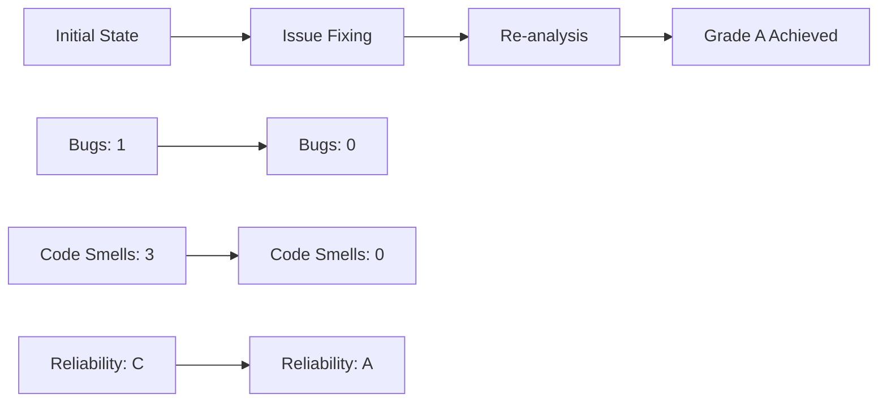
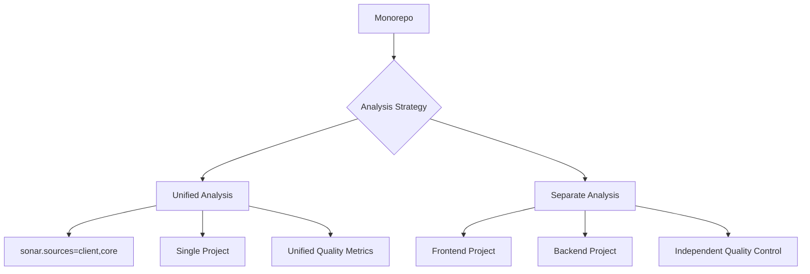

## Introduction

Code quality management is essential for developers. Maintaining consistent quality standards in a **Svelte + Django monorepo** project requires static analysis tools. This post shares our journey of setting up SonarQube Community Edition locally and achieving **zero bugs with Grade A quality**.

> "Code quality isn't optional - it's mandatory. SonarQube provides the objective metrics we need."

---

### 1. SonarQube Community Edition vs Cloud

| Feature | Community Edition | SonarCloud |
|---------|-------------------|------------|
| Cost | Free | Free for public repos, paid for private |
| Installation | Local Docker setup | Cloud service |
| PR Decoration | Not available (requires Developer+) | Available |
| Data Security | Local storage | External servers |
| Customization | Limited | Limited |

**Community Edition** is ideal for personal projects or security-sensitive environments.

---

### 2. Setting Up SonarQube with Docker

#### docker-compose.yml Configuration

```yaml
version: "3.9"
services:
  db-sq:
    image: postgres:15
    environment:
      POSTGRES_USER: sonar
      POSTGRES_PASSWORD: sonar
      POSTGRES_DB: sonar
    volumes:
      - postgresql:/var/lib/postgresql
      - postgresql_data:/var/lib/postgresql/data
    healthcheck:
      test: ["CMD-SHELL", "pg_isready -U sonar"]
      interval: 30s
      timeout: 10s
      retries: 3

  sonarqube:
    image: sonarqube:community
    depends_on:
      db-sq:
        condition: service_healthy
    environment:
      SONAR_JDBC_URL: jdbc:postgresql://db-sq:5432/sonar
      SONAR_JDBC_USERNAME: sonar
      SONAR_JDBC_PASSWORD: sonar
    volumes:
      - sonarqube_data:/opt/sonarqube/data
      - sonarqube_extensions:/opt/sonarqube/extensions
      - sonarqube_logs:/opt/sonarqube/logs
    ports:
      - "9000:9000"

volumes:
  sonarqube_data:
  sonarqube_extensions:
  sonarqube_logs:
  postgresql:
  postgresql_data:
```

#### Server Initialization

```bash
docker compose up -d
```

Initial startup takes 2-3 minutes. Access via `http://localhost:9000`.

---

### 3. Project Configuration & Analysis

#### Creating sonar-project.properties

```properties
sonar.projectKey=frontend
sonar.projectName=Frontend
sonar.sources=client,core
sonar.exclusions=**/node_modules/**,**/__pycache__/**,**/migrations/**
sonar.python.version=3.11
sonar.host.url=http://localhost:9000
```

#### Installing & Running SonarScanner CLI

```bash
# Download SonarScanner for Windows
curl -o sonar-scanner.zip https://binaries.sonarsource.com/Distribution/sonar-scanner-cli/sonar-scanner-cli-6.2.1.4610-windows-x64.zip
tar -xf sonar-scanner.zip

# Run analysis
.\sonar-scanner-6.2.1.4610-windows-x64\bin\sonar-scanner.bat -D"sonar.login=<token>"
```

---

### 4. Identified Issues & Resolution Process

#### Initial Analysis Results

| Metric | Value | Grade |
|--------|-------|-------|
| Bugs | 1 | C |
| Code Smells | 3 | A |
| Vulnerabilities | 0 | A |
| Duplications | 0% | A |
| Test Coverage | 0% | - |

#### Key Issues

1. **Missing HTML Title Tag** (Bug)
   ```html
   <!-- Before -->
   <head>
   	<meta charset="utf-8" />
   	<link rel="icon" href="%sveltekit.assets%/favicon.png" />
   	<meta name="viewport" content="width=device-width, initial-scale=1" />
   	%sveltekit.head%
   </head>

   <!-- After -->
   <head>
   	<meta charset="utf-8" />
   	<title>CV Factory - Professional Resume Builder</title>
   	<meta name="description" content="Create professional resumes with our easy-to-use CV builder" />
   	<link rel="icon" href="%sveltekit.assets%/favicon.png" />
   	<meta name="viewport" content="width=device-width, initial-scale=1" />
   	%sveltekit.head%
   </head>
   ```

2. **Unused TypeScript Import** (Code Smell)
   ```typescript
   // Before
   import { page } from '$app/stores';
   import type { LayoutLoad } from './$types';

   // After
   import type { LayoutLoad } from './$types';
   ```

3. **Recommend Nullish Coalescing over Logical OR** (Code Smell)
   ```typescript
   // Before
   export const prerender = data.prerender || false;

   // After  
   export const prerender = data.prerender ?? false;
   ```

4. **Unused Python Parameter** (Code Smell)
   ```python
   # Before
   def home(request):
       return render(request, 'core/home.html')

   # After
   def home(_request):
       return render(_request, 'core/home.html')
   ```

---

### 5. Achieving Perfect Grade A

#### Re-analysis Results



| Metric | Before | After | Change |
|--------|--------|-------|--------|
| Bugs | 1 | 0 | ✅ 100% resolved |
| Code Smells | 3 | 0 | ✅ 100% resolved |
| Reliability Grade | C | A | ⬆️ 2 levels up |
| Security Grade | A | A | ✅ maintained |
| Maintainability | A | A | ✅ maintained |

---

### 6. GitHub Actions vs Local Analysis

#### Limitations of GitHub Actions

```yaml
# Example of failing workflow
env:
  SONAR_HOST_URL: "http://localhost:9000"
  SONAR_TOKEN: ${{ secrets.SONAR_TOKEN }}
```

**Issues:**
- Cannot access `localhost:9000` from GitHub-hosted runners
- `Connection refused` errors occur

#### Solutions

1. **ngrok Tunneling** - Security risks, instability
2. **Port Forwarding** - Complex network setup
3. **Local Only** - Safest & simplest ✅

```bash
# Local analysis command
sonar-scanner \
  -Dsonar.projectKey=frontend \
  -Dsonar.sources=client,core \
  -Dsonar.host.url=http://localhost:9000 \
  -Dsonar.login=<token>
```

---

### 7. Project Cleanup & Optimization

#### Removing Unnecessary Files

```bash
# Saving 55MB+ space
rm sonar-scanner.zip                    # 54MB
rm -rf sonar-scanner-6.2.1.4610-*     # Unpacked files
rm -rf .scannerwork/                   # Temp directory
rm -rf node_modules/                   # Duplicate dependencies
```

#### Updating .gitignore

```gitignore
# SonarQube
.scannerwork/
sonar-scanner-*/
*.zip

# Development tools
.vscode/
.qodo/
```

#### Consolidated package.json

```json
{
  "name": "client",
  "scripts": {
    "dev": "vite dev",
    "build": "vite build",
    "lint": "eslint .",
    "lint:fix": "eslint . --fix",
    "format": "prettier --write ."
  },
  "devDependencies": {
    "@sveltejs/kit": "^2.16.0",
    "@typescript-eslint/eslint-plugin": "^8.35.1",
    "eslint": "^9.30.1",
    "prettier": "^3.6.2",
    "svelte": "^5.0.0"
  }
}
```

---

### 8. Community Edition Limitations & Alternatives

#### Limitations

| Feature | Community | Developer+ |
|---------|-----------|------------|
| Pull Request Decoration | ❌ | ✅ |
| Quality Gate Status | ❌ | ✅ |
| Branch Analysis | ❌ | ✅ |
| Portfolio Management | ❌ | ✅ |

#### Alternative Strategies

1. **Local Analysis Automation**
   ```bash
   # Pre-commit Git hook analysis
   #!/bin/sh
   sonar-scanner -Dsonar.login=$SONAR_TOKEN
   ```

2. **Manual Quality Control**
   - Regular analysis runs
   - Enhanced team code reviews
   - Quality metric monitoring

---

### 9. SonarQube in Monorepo

#### Unified vs Separate Analysis



**Benefits of Unified Analysis:**
- Holistic quality overview
- Simplified configuration
- Dependency relationship analysis

---

### 10. Continuous Quality Management

#### Quality Metric Monitoring

```bash
# Checking metrics via API
curl -u $SONAR_TOKEN: \
  "http://localhost:9000/api/measures/component?component=frontend&metricKeys=bugs,vulnerabilities,code_smells"
```

#### Improvement Roadmap

1. **Short-term (1-2 weeks)**
   - Fix all bugs
   - Maintain zero code smells
   
2. **Mid-term (1-2 months)**
   - Achieve 70% test coverage
   - Improve complexity metrics
   
3. **Long-term (3-6 months)**
   - Integrate CI/CD pipeline
   - Automated quality gates

---

## Conclusion

We achieved **zero bugs and Grade A quality** using SonarQube Community Edition. While advanced features like PR Decoration are limited, effective code quality management is fully achievable in a local environment.

Key achievements:
- 🐛 **100% bug resolution** (1 → 0)
- 🧹 **Complete code smell elimination** (3 → 0)
- 📈 **2-level reliability improvement** (C → A)
- 🗂️ **Project structure optimization** (55MB+ saved)

> 💡 **Lesson Learned**: Tools are just means. The real key is sustained improvement commitment and team collaboration.

Code quality isn't achieved overnight. The core lies in obtaining objective metrics through SonarQube and maintaining consistent improvement.