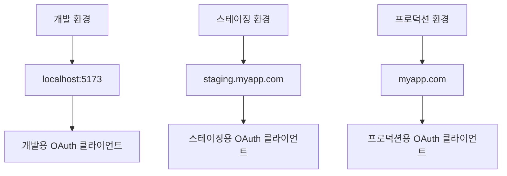
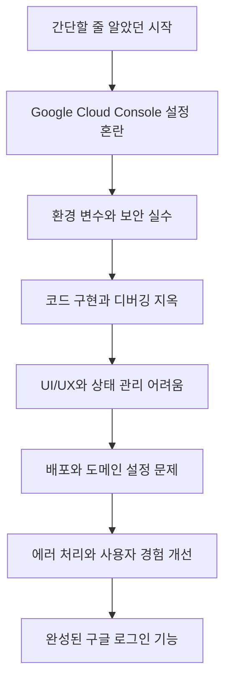

## Introduction

사이드 프로젝트를 만들면서 "구글 로그인 기능도 추가해볼까?" 하고 생각했습니다.

_"구글 로그인? 그냥 버튼 하나 만들고 API 몇 개 호출하면 되는 거 아닐까?"_

당시엔 몰랐지만 이 생각이 얼마나 많은 배움의 시작이 될지.

OAuth 2.0이라는 단어를 처음 마주했을 때부터 시작된 여정에서 정말 많은 것들을 배웠습니다. Google Cloud Console에서 헤매고, 환경 변수를 깃에 올릴 뻔하고, 팝업이 안 뜨는 이유를 몰라 고생했던 경험들이 지금은 소중한 학습 과정이 되었습니다.

> "생각보다 복잡했지만... 하나씩 해결해 나갔어요!"

이 글은 주니어 개발자분들이 구글 로그인 구현 시 겪을 수 있는 시행착오를 조금 덜 경험하시길 바라는 마음으로 작성했습니다. **Svelte/SvelteKit** 환경에서 구현한 실제 코드와 함께, 어떤 선택을 했고 어떤 문제에 부딪혔는지 솔직하게 공유합니다.

현재 구글 로그인 구현을 계획 중이시라면 이 글이 조금이나마 도움이 되길 바랍니다. 적어도 "왜 안 되지?"라고 몇 시간씩 고민하는 시간은 줄일 수 있을 거예요.

## 1. 시행착오 1 - Google Cloud Console 설정의 혼란

### 첫 번째 관문: "어디서부터 시작하지?"

구글링을 통해 "구글 로그인 구현"을 검색했을 때 나온 첫 단계는 **Google Cloud Console**에서 OAuth 2.0 클라이언트 ID 생성이었습니다.

_"쉽겠다, 만들기만 하면 되겠네."_

하지만 [console.cloud.google.com](https://console.cloud.google.com)에 들어가자마자 당황했습니다. 프로젝트 생성부터 API 활성화, OAuth 동의 화면 설정, 클라이언트 ID 생성까지... 예상보다 과정이 많았습니다.

### 실수 1: OAuth 동의 화면을 대충 설정

OAuth 동의 화면 설정에서 "내부용"과 "외부용" 중 선택을 잘못했습니다. 나중에야 알았지만 개인 프로젝트나 공개 서비스는 "외부용"을 선택해야 합니다.

- **내부용**: Google Workspace 조직 내부 사용자만
- **외부용**: 모든 Google 계정 사용자 (일반적인 선택)

### 실수 2: Redirect URI를 잘못 설정

가장 큰 문제는 **승인된 리디렉션 URI** 설정이

가장 큰 삽질이 바로 **승인된 리디렉션 URI** 설정이었다.

처음에는 이렇게 설정했다:

```
http://localhost:3000/callback
```

하지만 실제로는 이렇게 설정해야 했다:

```
http://localhost:5173          # Vite 개발 서버
http://localhost:5173/         # 슬래시 포함 버전
https://cvfactory.dev          # 프로덕션 도메인
```

Redirect URI는 정확히 일치해야 한다는 걸 알게 되었다. 포트 번호, 슬래시 하나까지도 틀리면 `redirect_uri_mismatch` 에러가 발생한다.

### 해결 과정: 체계적으로 다시 설정

몇 시간의 삽질 끝에 올바른 설정 방법을 찾았다:

#### 1단계: 프로젝트 생성

```
프로젝트 이름: my-awesome-app
프로젝트 ID: my-awesome-app-123456 (자동 생성)
```

#### 2단계: API 활성화

- Google Identity Services API 활성화
- (선택사항) Google+ API도 활성화

#### 3단계: OAuth 동의 화면 설정

```yaml
애플리케이션 이름: CV Factory
사용자 지원 이메일: your-email@gmail.com
승인된 도메인: cvfactory.dev (프로덕션용)
개발자 연락처 정보: your-email@gmail.com
```

#### 4단계: OAuth 2.0 클라이언트 ID 생성

```yaml
애플리케이션 유형: 웹 애플리케이션
이름: Web Client
승인된 JavaScript 원본:
  - http://localhost:5173
  - https://cvfactory.dev
승인된 리디렉션 URI:
  - http://localhost:5173
  - https://cvfactory.dev
```

### 최종 결과물

설정이 완료되면 이런 정보를 얻게 된다:

```javascript
클라이언트 ID: 123456789-abcdefghijklmnop.apps.googleusercontent.com
클라이언트 보안 비밀: GOCSPX-abcdefghijklmnopqrstuvwxyz
```

**중요**: 클라이언트 보안 비밀은 프론트엔드에서 사용하지 않는다! (이것도 나중에 알게 된 사실...)

몇 시간의 삽질을 통해 알게 된 것들:

1. 급하게 하려다가 더 오래 걸렸다
2. 개발용과 프로덕션용 URI를 모두 등록해두면 편하다
3. Google의 공식 문서가 생각보다 친절했다
4. localhost 포트 번호를 미리 확인해두면 좋다

다음 단계에서는 이 클라이언트 ID를 어떻게 코드에서 사용하는지, 그리고 환경 변수 설정에서 또 어떤 실수를 했는지 이야기해보겠다.

## 2. 시행착오 2 - 환경 변수와 보안 실수

### 위험했던 순간: 클라이언트 시크릿을 프론트엔드에?

Google Cloud Console에서 클라이언트 ID와 클라이언트 시크릿을 받고 나서, 당연히 둘 다 프론트엔드 코드에서 사용해야 한다고 생각했다.

```javascript
// ❌ 절대 하면 안 되는 코드
const GOOGLE_CLIENT_ID = "123456789-abc.apps.googleusercontent.com";
const GOOGLE_CLIENT_SECRET = "GOCSPX-very-secret-key"; // 위험!

// 이걸 그대로 커밋하려고 했다...
```

다행히 커밋하기 전에 뭔가 이상하다는 생각이 들어서 다시 찾아봤다. 그리고 충격적인 사실을 알게 되었다.

> **클라이언트 시크릿은 프론트엔드에서 사용하지 않는다!**

OAuth 2.0에는 여러 플로우가 있는데, 프론트엔드에서는 **Implicit Flow** 또는 **Authorization Code Flow with PKCE**를 사용한다. 클라이언트 시크릿은 서버 사이드에서만 사용하는 것이었다.

### 실수 1: .env 파일을 깃에 올릴 뻔

환경 변수를 사용해야 한다는 걸 알고 나서 `.env` 파일을 만들었다:

```bash
# .env
VITE_GOOGLE_OAUTH_CLIENT_ID=123456789-abc.apps.googleusercontent.com
VITE_DEBUG_OAUTH=true
```

그리고 습관적으로 `git add .`을 했다가... 아차 싶어서 급하게 취소했다.

```bash
git reset HEAD .env  # 휴... 위험했다
```

### 실수 2: VITE\_ 접두사를 몰랐음

처음에는 이렇게 환경 변수를 설정했다:

```bash
# ❌ 잘못된 방법
GOOGLE_OAUTH_CLIENT_ID=123456789-abc.apps.googleusercontent.com
```

그런데 코드에서 `import.meta.env.GOOGLE_OAUTH_CLIENT_ID`로 접근하면 `undefined`가 나왔다.

몇 시간을 헤매다가 Vite 문서를 읽고 나서야 알았다. **Vite에서는 클라이언트 사이드에서 접근할 환경 변수에 `VITE_` 접두사를 붙여야 한다.**

```bash
# ✅ 올바른 방법
VITE_GOOGLE_OAUTH_CLIENT_ID=123456789-abc.apps.googleusercontent.com
VITE_DEBUG_OAUTH=true
```

### 실수 3: 환경 변수 파일 관리

개발하면서 여러 환경 변수 파일을 만들게 되었다:

```
.env                    # 기본 설정
.env.local             # 로컬 개발용 (gitignore)
.env.development       # 개발 환경용
.env.production        # 프로덕션용
```

처음에는 이 차이를 몰라서 모든 파일을 깃에 올리려고 했다. 다행히 `.env.local`은 자동으로 gitignore되지만, 나머지는 수동으로 관리해야 했다.

### 올바른 환경 변수 설정

#### .env (기본 설정, 깃에 포함 가능)

```bash
# 기본값들 (민감하지 않은 정보)
VITE_DEBUG_OAUTH=false
VITE_APP_NAME=My Awesome App
```

#### .env.local (로컬 개발용, gitignore 필수)

```bash
# 실제 클라이언트 ID (민감한 정보)
VITE_GOOGLE_OAUTH_CLIENT_ID=123456789-abc.apps.googleusercontent.com
VITE_DEBUG_OAUTH=true
```

#### .gitignore 설정

```gitignore
# Environment variables
.env.local
.env.*.local
.env.production
```

### 코드에서 환경 변수 사용하기

```typescript
// lib/google-auth.ts
const CLIENT_ID = import.meta.env.VITE_GOOGLE_OAUTH_CLIENT_ID;
const DEBUG = import.meta.env.VITE_DEBUG_OAUTH === "true";

// 환경 변수가 없을 때 에러 처리
if (!CLIENT_ID) {
  throw new Error("VITE_GOOGLE_OAUTH_CLIENT_ID가 설정되지 않았습니다.");
}

if (DEBUG) {
  console.log("Google OAuth Client ID:", CLIENT_ID);
}
```

### 프로덕션 배포 시 주의사항

배포할 때는 환경 변수를 플랫폼별로 설정해야 한다:

#### Vercel

```bash
vercel env add VITE_GOOGLE_OAUTH_CLIENT_ID
```

#### Netlify

```bash
# netlify.toml
[build.environment]
  VITE_GOOGLE_OAUTH_CLIENT_ID = "your-production-client-id"
```

#### Docker

```dockerfile
# Dockerfile
ARG VITE_GOOGLE_OAUTH_CLIENT_ID
ENV VITE_GOOGLE_OAUTH_CLIENT_ID=$VITE_GOOGLE_OAUTH_CLIENT_ID
```

### 보안 체크리스트

삽질하면서 정리한 체크리스트:

- [ ] 클라이언트 시크릿은 프론트엔드에서 사용하지 않기
- [ ] 환경 변수에 `VITE_` 접두사 붙이기
- [ ] `.env.local` 파일은 gitignore에 추가하기
- [ ] 프로덕션 환경 변수는 별도로 관리하기
- [ ] 환경 변수 누락 시 에러 처리하기

### 배운 점

1. **보안은 처음부터**: 나중에 고치려면 더 어렵다
2. **문서를 읽자**: Vite 환경 변수 규칙을 미리 알았으면 시간을 절약했을 것
3. **환경별 설정**: 개발/스테이징/프로덕션 환경을 구분해서 관리하자
4. **실수는 누구나**: 중요한 건 실수를 반복하지 않는 것

이제 환경 변수 설정은 끝났다. 다음에는 실제 코드 구현에서 어떤 삽질을 했는지 이야기해보겠다.

## 3. 시행착오 3 - 코드 구현과 디버깅 지옥

### 첫 번째 좌절: "팝업이 안 뜨는데 왜지?"

환경 변수 설정까지 끝내고 드디어 코드를 작성할 차례가 되었다. Google의 공식 문서를 보면서 이렇게 시작했다:

```javascript
// ❌ 첫 번째 시도 - 너무 단순하게 생각했다
function loginWithGoogle() {
  gapi.load("auth2", function () {
    gapi.auth2.init({
      client_id: "my-client-id",
    });
  });
}
```

당연히 `gapi is not defined` 에러가 났다. 스크립트를 로드하지 않았으니까.

### 실수 1: Google API 스크립트 로딩 타이밍

HTML에 스크립트 태그를 추가했다:

```html
<!-- ❌ 이렇게 하면 안 된다 -->
<script src="https://apis.google.com/js/api.js"></script>
```

하지만 SvelteKit에서는 이 방법이 제대로 작동하지 않았다. 스크립트가 로드되기 전에 컴포넌트가 마운트되어서 여전히 `gapi is not defined` 에러가 발생했다.

몇 시간을 헤매다가 **동적으로 스크립트를 로드**하는 방법을 찾았다:

```typescript
// ✅ 올바른 방법 - 동적 스크립트 로딩
private loadGoogleIdentityScript(): Promise<void> {
  return new Promise((resolve, reject) => {
    // 이미 로드되었는지 확인
    if (window.google?.accounts) {
      resolve();
      return;
    }

    const script = document.createElement('script');
    script.src = 'https://accounts.google.com/gsi/client';
    script.onload = () => resolve();
    script.onerror = () => reject(new Error('Google Identity Services 로드에 실패했습니다.'));
    document.head.appendChild(script);
  });
}
```

### 실수 2: 구식 API vs 신식 API

처음에는 `gapi.auth2`를 사용하려고 했는데, 알고 보니 이건 **deprecated**된 방법이었다. 2023년부터는 **Google Identity Services**를 사용해야 한다.

```javascript
// ❌ 구식 방법 (deprecated)
gapi.load("auth2", function () {
  const authInstance = gapi.auth2.getAuthInstance();
});

// ✅ 신식 방법 (Google Identity Services)
window.google.accounts.oauth2.initTokenClient({
  client_id: CLIENT_ID,
  scope: "profile email",
  callback: handleAuthResponse,
});
```

이 차이를 모르고 구식 문서를 보면서 몇 시간을 날렸다.

### 실수 3: "토큰이 뭐지? 사용자 정보는 어떻게 가져오지?"

OAuth 플로우를 제대로 이해하지 못해서 토큰을 받고 나서 뭘 해야 할지 몰랐다.

```javascript
// ❌ 토큰을 받고 나서 멍하니 있었던 코드
callback: (response) => {
  console.log("토큰 받았다!", response.access_token);
  // 그래서... 이제 뭘 하지?
};
```

구글링을 통해 알아낸 것은 **액세스 토큰으로 사용자 정보 API를 호출**해야 한다는 것이었다:

```typescript
// ✅ 올바른 방법 - 토큰으로 사용자 정보 가져오기
callback: async (response: any) => {
  if (response.error) {
    reject(new Error("구글 로그인에 실패했습니다."));
    return;
  }

  try {
    // 액세스 토큰으로 사용자 정보 요청
    const userInfoResponse = await fetch(
      `https://www.googleapis.com/oauth2/v2/userinfo?access_token=${response.access_token}`
    );

    if (!userInfoResponse.ok) {
      throw new Error("사용자 정보를 가져오는데 실패했습니다.");
    }

    const userInfo = await userInfoResponse.json();

    const user: GoogleUser = {
      id: userInfo.id,
      email: userInfo.email,
      name: userInfo.name,
      picture: userInfo.picture,
      given_name: userInfo.given_name,
      family_name: userInfo.family_name,
    };

    resolve(user);
  } catch (error) {
    reject(new Error("사용자 정보를 가져오는데 실패했습니다."));
  }
};
```

### 실수 4: 에러 처리를 대충 했다가...

처음에는 에러 처리를 이렇게 대충 했다:

```javascript
// ❌ 대충한 에러 처리
.catch(error => {
  console.error('에러 발생:', error);
  alert('로그인 실패!');
});
```

하지만 실제로 테스트해보니 다양한 에러 상황이 있었다:

1. **팝업 차단**: 브라우저에서 팝업을 차단했을 때
2. **팝업 닫기**: 사용자가 팝업을 중간에 닫았을 때
3. **네트워크 오류**: 인터넷 연결이 불안정할 때
4. **권한 거부**: 사용자가 권한을 거부했을 때

각각에 대해 적절한 메시지를 보여주도록 개선했다:

```typescript
// ✅ 세분화된 에러 처리
error_callback: (error: any) => {
  if (DEBUG) console.error("Sign in error:", error);

  if (error.type === "popup_closed") {
    reject(new Error("로그인이 취소되었습니다."));
  } else if (error.type === "popup_blocked") {
    reject(new Error("팝업이 차단되었습니다. 브라우저 설정을 확인해주세요."));
  } else if (!navigator.onLine) {
    reject(new Error("네트워크 연결을 확인해주세요."));
  } else {
    reject(new Error("구글 로그인에 실패했습니다. 다시 시도해주세요."));
  }
};
```

### 완성된 GoogleAuthService 클래스

몇 시간의 삽질 끝에 완성된 코드:

```typescript
// lib/google-auth.ts
import { browser } from "$app/environment";

export interface GoogleUser {
  id: string;
  email: string;
  name: string;
  picture: string;
  given_name?: string;
  family_name?: string;
}

const CLIENT_ID = import.meta.env.VITE_GOOGLE_OAUTH_CLIENT_ID;
const DEBUG = import.meta.env.VITE_DEBUG_OAUTH === "true";

class GoogleAuthService {
  private isInitialized = false;

  async initialize(): Promise<void> {
    if (!browser || this.isInitialized) return;

    try {
      // Google Identity Services 스크립트 동적 로딩
      await this.loadGoogleIdentityScript();

      this.isInitialized = true;
      if (DEBUG) console.log("Google Identity Services initialized");
    } catch (error) {
      console.error("Failed to initialize Google Auth:", error);
      throw new Error("구글 인증 초기화에 실패했습니다.");
    }
  }

  private loadGoogleIdentityScript(): Promise<void> {
    return new Promise((resolve, reject) => {
      if (window.google?.accounts) {
        resolve();
        return;
      }

      const script = document.createElement("script");
      script.src = "https://accounts.google.com/gsi/client";
      script.onload = () => resolve();
      script.onerror = () =>
        reject(new Error("Google Identity Services 로드에 실패했습니다."));
      document.head.appendChild(script);
    });
  }

  async signIn(): Promise<GoogleUser> {
    if (!this.isInitialized) {
      await this.initialize();
    }

    return new Promise((resolve, reject) => {
      try {
        window.google.accounts.oauth2
          .initTokenClient({
            client_id: CLIENT_ID,
            scope: "profile email",
            callback: async (response: any) => {
              // ... (위에서 본 콜백 코드)
            },
            error_callback: (error: any) => {
              // ... (위에서 본 에러 처리 코드)
            },
          })
          .requestAccessToken();
      } catch (error: any) {
        if (DEBUG) console.error("Sign in initialization error:", error);
        reject(new Error("구글 로그인 초기화에 실패했습니다."));
      }
    });
  }

  // ... 기타 메서드들
}

export const googleAuth = new GoogleAuthService();
```

### 디버깅 팁

삽질하면서 배운 디버깅 팁들:

1. **DEBUG 모드 활용**: 환경 변수로 디버그 로그 켜고 끄기
2. **브라우저 개발자 도구**: Network 탭에서 API 호출 확인
3. **단계별 테스트**: 스크립트 로딩 → 초기화 → 로그인 → 사용자 정보 순서로
4. **에러 메시지 자세히 보기**: `error.type`으로 에러 종류 구분

### 배운 점

1. **최신 API 사용**: deprecated된 API 말고 최신 버전 사용하기
2. **비동기 처리**: 스크립트 로딩, API 호출 모두 비동기로 처리
3. **에러 처리**: 사용자 친화적인 에러 메시지 제공
4. **타입 안전성**: TypeScript 인터페이스로 데이터 구조 명확히 하기

드디어 로그인 기능이 작동했다! 하지만 UI는... 버튼 하나만 달랑 있었다. 다음에는 제대로 된 UI를 만들면서 또 어떤 삽질을 했는지 이야기해보겠다.

## 4. 시행착오 4 - UI/UX와 상태 관리의 어려움

### 초라한 시작: 버튼 하나만 달랑

로그인 기능이 작동하는 걸 확인하고 나서 의기양양하게 UI를 만들기 시작했다. 처음에는 정말 단순했다:

```svelte
<!-- ❌ 초라한 첫 번째 버전 -->
<button on:click={loginWithGoogle}>
  구글 로그인
</button>
```

_"이것도 나름 깔끔한데?"_ 라고 생각했지만, 실제로 사용해보니 문제가 한두 개가 아니었다:

1. 로그인 중인지 알 수 없음 (로딩 상태 없음)
2. 로그인 후에도 같은 버튼이 보임
3. 에러가 발생해도 사용자가 모름
4. 로그인한 사용자 정보를 어디에도 표시하지 않음

### 실수 1: 상태 관리를 컴포넌트 내부에서만

처음에는 모든 상태를 컴포넌트 내부에서 관리하려고 했다:

```svelte
<!-- ❌ 컴포넌트 내부에서만 상태 관리 -->
<script>
  let isLoggedIn = false;
  let user = null;
  let isLoading = false;
  let error = null;

  async function handleLogin() {
    isLoading = true;
    try {
      user = await googleAuth.signIn();
      isLoggedIn = true;
    } catch (err) {
      error = err.message;
    } finally {
      isLoading = false;
    }
  }
</script>
```

하지만 이렇게 하면 **다른 컴포넌트에서 로그인 상태를 알 수 없다**는 문제가 있었다. 헤더에서 로그인했는데 사이드바에서는 여전히 로그인하라고 나오는 상황이 발생했다.

### 해결책: Svelte Store로 전역 상태 관리

몇 시간 고민하다가 **Svelte Store**를 사용하기로 했다:

```typescript
// lib/stores/auth.ts
import { writable } from "svelte/store";
import { browser } from "$app/environment";
import { googleAuth, type GoogleUser } from "../google-auth.js";

export interface AuthState {
  isLoggedIn: boolean;
  user: GoogleUser | null;
  isLoading: boolean;
  error: string | null;
}

const initialState: AuthState = {
  isLoggedIn: false,
  user: null,
  isLoading: false,
  error: null,
};

function createAuthStore() {
  const { subscribe, set, update } = writable<AuthState>(initialState);

  return {
    subscribe,

    async login() {
      update((state) => ({ ...state, isLoading: true, error: null }));

      try {
        const user = await googleAuth.signIn();

        // localStorage에 저장 (새로고침 시에도 로그인 상태 유지)
        if (browser) {
          localStorage.setItem("auth_user", JSON.stringify(user));
          localStorage.setItem("auth_logged_in", "true");
        }

        update((state) => ({
          ...state,
          isLoggedIn: true,
          user,
          isLoading: false,
          error: null,
        }));
      } catch (error: any) {
        update((state) => ({
          ...state,
          isLoading: false,
          error: error.message || "로그인에 실패했습니다.",
        }));
        throw error;
      }
    },

    async logout() {
      update((state) => ({ ...state, isLoading: true, error: null }));

      try {
        await googleAuth.signOut();

        // localStorage 정리
        if (browser) {
          localStorage.removeItem("auth_user");
          localStorage.removeItem("auth_logged_in");
        }

        update((state) => ({
          ...state,
          isLoggedIn: false,
          user: null,
          isLoading: false,
          error: null,
        }));
      } catch (error: any) {
        update((state) => ({
          ...state,
          isLoading: false,
          error: error.message || "로그아웃에 실패했습니다.",
        }));
        throw error;
      }
    },

    // 페이지 로드 시 로그인 상태 확인
    async checkAuthStatus() {
      if (!browser) return;

      update((state) => ({ ...state, isLoading: true }));

      try {
        const savedUser = localStorage.getItem("auth_user");
        const isLoggedIn = localStorage.getItem("auth_logged_in") === "true";

        if (savedUser && isLoggedIn) {
          const user = JSON.parse(savedUser);

          update((state) => ({
            ...state,
            isLoggedIn: true,
            user,
            isLoading: false,
            error: null,
          }));
        } else {
          update((state) => ({
            ...state,
            isLoggedIn: false,
            user: null,
            isLoading: false,
            error: null,
          }));
        }
      } catch (error) {
        console.error("Auth status check failed:", error);
        update((state) => ({
          ...state,
          isLoggedIn: false,
          user: null,
          isLoading: false,
          error: null,
        }));
      }
    },

    clearError() {
      update((state) => ({ ...state, error: null }));
    },
  };
}

export const authStore = createAuthStore();
```

### 실수 2: UI 상태 변화를 고려하지 않음

Store를 만들고 나서 UI를 다시 만들기 시작했는데, 처음에는 이런 식으로 단순하게 생각했다:

```svelte
<!-- ❌ 너무 단순한 생각 -->
{#if isLoggedIn}
  <span>안녕하세요, {user.name}님!</span>
{:else}
  <button on:click={handleLogin}>구글 로그인</button>
{/if}
```

하지만 실제로는 더 많은 상태를 고려해야 했다:

1. **로딩 중**: 버튼 비활성화, 스피너 표시
2. **에러 발생**: 에러 메시지 표시, 닫기 버튼
3. **로그인 후**: 사용자 정보 표시, 드롭다운 메뉴
4. **모바일 대응**: 작은 화면에서는 사용자 이름 숨기기

### 완성된 GoogleAuthButton 컴포넌트

여러 번의 시행착오를 거쳐 완성된 컴포넌트:

```svelte
<!-- lib/components/GoogleAuthButton.svelte -->
<script lang="ts">
  import { onMount } from 'svelte';
  import { _ } from 'svelte-i18n';
  import { authStore } from '../stores/auth.js';

  let showDropdown = false;
  let dropdownRef: HTMLElement;

  // Store 구독 (반응형)
  $: ({ isLoggedIn, user, isLoading, error } = $authStore);

  onMount(() => {
    // 컴포넌트 마운트 시 로그인 상태 확인
    authStore.checkAuthStatus();

    // 드롭다운 외부 클릭 시 닫기
    const handleClickOutside = (event: MouseEvent) => {
      if (dropdownRef && !dropdownRef.contains(event.target as Node)) {
        showDropdown = false;
      }
    };

    document.addEventListener('click', handleClickOutside);
    return () => document.removeEventListener('click', handleClickOutside);
  });

  async function handleLogin() {
    try {
      await authStore.login();
    } catch (error) {
      // 에러는 이미 store에서 처리됨
      console.error('Login failed:', error);
    }
  }

  async function handleLogout() {
    try {
      await authStore.logout();
      showDropdown = false;
    } catch (error) {
      console.error('Logout failed:', error);
    }
  }

  function toggleDropdown() {
    showDropdown = !showDropdown;
  }

  function clearError() {
    authStore.clearError();
  }
</script>

<div class="auth-container">
  <!-- 에러 메시지 -->
  {#if error}
    <div class="error-message">
      {error}
      <button class="error-close" on:click={clearError}>×</button>
    </div>
  {/if}

  {#if isLoggedIn && user}
    <!-- 로그인된 상태 -->
    <div class="user-profile" bind:this={dropdownRef}>
      <button class="profile-button" on:click={toggleDropdown} disabled={isLoading}>
        
        <span class="user-name">{user.name}</span>
        <svg class="dropdown-arrow" class:rotated={showDropdown} width="12" height="12" viewBox="0 0 12 12">
          <path fill="currentColor" d="M6 8L2 4h8z"/>
        </svg>
      </button>

      {#if showDropdown}
        <div class="dropdown-menu">
          <div class="user-info">
            <div class="user-name-full">{user.name}</div>
            <div class="user-email">{user.email}</div>
          </div>
          <hr class="dropdown-divider" />
          <button class="logout-button" on:click={handleLogout} disabled={isLoading}>
            {isLoading ? $_('logging_out') : $_('logout')}
          </button>
        </div>
      {/if}
    </div>
  {:else}
    <!-- 로그인되지 않은 상태 -->
    <button class="login-button" on:click={handleLogin} disabled={isLoading}>
      {#if isLoading}
        <div class="spinner"></div>
        {$_('logging_in')}
      {:else}
        <!-- 구글 아이콘 SVG -->
        <svg class="google-icon" width="18" height="18" viewBox="0 0 24 24">
          <path fill="#4285F4" d="M22.56 12.25c0-.78-.07-1.53-.2-2.25H12v4.26h5.92c-.26 1.37-1.04 2.53-2.21 3.31v2.77h3.57c2.08-1.92 3.28-4.74 3.28-8.09z"/>
          <path fill="#34A853" d="M12 23c2.97 0 5.46-.98 7.28-2.66l-3.57-2.77c-.98.66-2.23 1.06-3.71 1.06-2.86 0-5.29-1.93-6.16-4.53H2.18v2.84C3.99 20.53 7.7 23 12 23z"/>
          <path fill="#FBBC05" d="M5.84 14.09c-.22-.66-.35-1.36-.35-2.09s.13-1.43.35-2.09V7.07H2.18C1.43 8.55 1 10.22 1 12s.43 3.45 1.18 4.93l2.85-2.22.81-.62z"/>
          <path fill="#EA4335" d="M12 5.38c1.62 0 3.06.56 4.21 1.64l3.15-3.15C17.45 2.09 14.97 1 12 1 7.7 1 3.99 3.47 2.18 7.07l3.66 2.84c.87-2.6 3.3-4.53 6.16-4.53z"/>
        </svg>
        {$_('google_login')}
      {/if}
    </button>
  {/if}
</div>

<style>
  /* CSS 스타일링 - 생략 (실제로는 200줄 정도) */
  .auth-container {
    position: relative;
    display: flex;
    flex-direction: column;
    align-items: flex-end;
    gap: 8px;
  }

  .login-button {
    display: flex;
    align-items: center;
    gap: 8px;
    background: white;
    border: 1px solid #dadce0;
    border-radius: 4px;
    padding: 8px 16px;
    font-size: 14px;
    font-weight: 500;
    color: #3c4043;
    cursor: pointer;
    transition: all 0.2s;
    min-height: 44px;
  }

  .spinner {
    width: 16px;
    height: 16px;
    border: 2px solid #f3f3f3;
    border-top: 2px solid #3c4043;
    border-radius: 50%;
    animation: spin 1s linear infinite;
  }

  @keyframes spin {
    0% { transform: rotate(0deg); }
    100% { transform: rotate(360deg); }
  }

  /* 모바일 대응 */
  @media (max-width: 768px) {
    .user-name {
      display: none; /* 작은 화면에서는 이름 숨기기 */
    }
  }
</style>
```

### 실수 3: localStorage 동기화 문제

처음에는 새로고침할 때마다 로그인 상태가 초기화되는 문제가 있었다. `localStorage`에 저장은 했지만, 페이지 로드 시 확인하는 로직이 없었기 때문이다.

```typescript
// ❌ 문제가 있던 코드
onMount(() => {
  // 아무것도 안 함 - 새로고침하면 로그인 상태 사라짐
});

// ✅ 해결된 코드
onMount(() => {
  authStore.checkAuthStatus(); // 페이지 로드 시 상태 확인
});
```

### 배운 점

1. **상태 관리는 전역으로**: 여러 컴포넌트에서 사용할 상태는 Store 사용
2. **모든 상태 고려**: 로딩, 에러, 성공 상태 모두 UI에 반영
3. **사용자 경험**: 로딩 스피너, 에러 메시지, 피드백 제공
4. **반응형 디자인**: 모바일에서도 잘 보이도록 고려
5. **상태 지속성**: localStorage로 새로고침 후에도 상태 유지

드디어 그럴듯한 UI가 완성되었다! 하지만 로컬에서만 테스트했을 뿐, 실제 배포하면서 또 다른 문제들을 마주하게 되었다. 다음에는 배포 과정에서의 삽질을 이야기해보겠다.

## 5. 시행착오 5 - 배포와 도메인 설정 문제

### 클래식한 문제: "로컬에서는 되는데..."

로컬에서 완벽하게 작동하는 구글 로그인을 보고 의기양양하게 배포했다. Northflank에 올리고 나서 테스트해보니...

```
Error: redirect_uri_mismatch
```

_"아... 또 이거구나."_

### 실수 1: 프로덕션 도메인을 Google Cloud Console에 등록 안 함

로컬에서만 테스트하다 보니 `http://localhost:5173`만 등록해두고 실제 도메인은 깜빡했다.

```
# Google Cloud Console에 등록된 URI
✅ http://localhost:5173
❌ https://cvfactory.dev  # 이걸 깜빡!
```

급하게 Google Cloud Console로 가서 프로덕션 도메인을 추가했다:

```
승인된 JavaScript 원본:
- http://localhost:5173
- https://cvfactory.dev

승인된 리디렉션 URI:
- http://localhost:5173
- https://cvfactory.dev
```

### 실수 2: 환경 변수를 배포 플랫폼에 설정 안 함

도메인을 추가하고 나서도 여전히 에러가 났다. 이번에는 다른 에러였다:

```
Error: VITE_GOOGLE_OAUTH_CLIENT_ID가 설정되지 않았습니다.
```

_"아, 환경 변수를 배포 서버에 설정 안 했구나!"_

#### Northflank에서 환경 변수 설정

Northflank 대시보드에서 Environment Variables 섹션으로 가서 추가했다:

```
VITE_GOOGLE_OAUTH_CLIENT_ID = 123456789-abc.apps.googleusercontent.com
VITE_DEBUG_OAUTH = false
```

#### 다른 플랫폼들도 비슷한 방식

```bash
# Vercel
vercel env add VITE_GOOGLE_OAUTH_CLIENT_ID

# Netlify
netlify env:set VITE_GOOGLE_OAUTH_CLIENT_ID "your-client-id"

# Docker 배포 시
docker run -e VITE_GOOGLE_OAUTH_CLIENT_ID="your-client-id" my-app
```

### 실수 3: 개발용과 프로덕션용 클라이언트 ID를 구분 안 함

처음에는 개발용과 프로덕션용을 같은 클라이언트 ID로 사용했다. 이렇게 해도 작동은 하지만, 보안상 좋지 않다고 나중에 알게 되었다.

#### 올바른 방법: 환경별로 분리

```bash
# 개발 환경 (.env.local)
VITE_GOOGLE_OAUTH_CLIENT_ID=123456789-dev.apps.googleusercontent.com

# 프로덕션 환경 (배포 플랫폼 설정)
VITE_GOOGLE_OAUTH_CLIENT_ID=987654321-prod.apps.googleusercontent.com
```

각각 다른 Google Cloud Console 프로젝트나 다른 OAuth 클라이언트로 관리하는 것이 좋다.

### 실수 4: HTTPS vs HTTP 혼동

로컬에서는 `http://localhost`를 사용하지만, 프로덕션에서는 `https://`를 사용해야 한다. 이 차이 때문에 CORS 에러가 발생하기도 했다.

```javascript
// ❌ 하드코딩된 URL
const redirectUri = "http://localhost:5173";

// ✅ 환경에 따라 동적으로 설정
const redirectUri = window.location.origin;
```

### 실수 5: 캐시 문제

환경 변수를 수정하고 재배포했는데도 여전히 이전 값이 사용되는 경우가 있었다. 이는 빌드 캐시 때문이었다.

#### 해결 방법

```bash
# Northflank - 새로운 빌드 트리거
# 대시보드에서 "Rebuild" 버튼 클릭하거나 새 커밋 푸시

# Vercel - 캐시 무시하고 재배포
vercel --force

# Netlify - 캐시 클리어
netlify build --clear-cache

# 로컬 - node_modules와 빌드 폴더 삭제
rm -rf node_modules .svelte-kit
npm install
npm run build
```

### 도메인 변경 시 체크리스트

나중에 도메인을 변경할 때를 대비해서 만든 체크리스트:

- [ ] Google Cloud Console에서 새 도메인 추가
- [ ] 기존 도메인 제거 (필요시)
- [ ] 배포 플랫폼에서 환경 변수 확인
- [ ] 빌드 캐시 클리어 후 재배포
- [ ] 새 도메인에서 로그인 테스트
- [ ] 모바일에서도 테스트

### 환경별 설정 관리 전략

여러 번의 실수를 통해 정리한 환경별 설정 관리 방법:



#### 환경별 설정 파일

```typescript
// lib/config.ts
const config = {
  development: {
    googleClientId: import.meta.env.VITE_GOOGLE_OAUTH_CLIENT_ID_DEV,
    debug: true,
  },
  staging: {
    googleClientId: import.meta.env.VITE_GOOGLE_OAUTH_CLIENT_ID_STAGING,
    debug: true,
  },
  production: {
    googleClientId: import.meta.env.VITE_GOOGLE_OAUTH_CLIENT_ID_PROD,
    debug: false,
  },
};

const environment = import.meta.env.MODE || "development";
export default config[environment];
```

### CORS 문제 해결

배포 후에 가끔 CORS 에러가 발생했다. 이는 Google API 호출 시 발생하는 문제였다.

```javascript
// 문제가 되었던 코드
fetch("https://www.googleapis.com/oauth2/v2/userinfo", {
  headers: {
    Authorization: `Bearer ${accessToken}`,
    "Content-Type": "application/json", // 이 헤더가 문제였음
  },
});

// 해결된 코드
fetch(
  `https://www.googleapis.com/oauth2/v2/userinfo?access_token=${accessToken}`
);
```

### 배포 자동화

매번 수동으로 환경 변수를 설정하는 게 번거로워서 배포 자동화를 구성했다:

```yaml
# .github/workflows/deploy.yml
name: Deploy
on:
  push:
    branches: [main]

jobs:
  deploy:
    runs-on: ubuntu-latest
    steps:
      - uses: actions/checkout@v2

      # Northflank는 Git 연동으로 자동 배포
      # 별도 액션 없이 푸시만으로 배포 트리거
      - name: Trigger Northflank Deploy
        run: echo "Northflank will auto-deploy from Git push"
```

### 배운 점

1. **환경별 분리**: 개발/스테이징/프로덕션 환경을 명확히 구분
2. **도메인 관리**: 새 도메인 추가 시 Google Cloud Console 설정 잊지 말기
3. **환경 변수**: 배포 플랫폼마다 설정 방법이 다름
4. **캐시 주의**: 설정 변경 후 캐시 클리어 필수
5. **테스트**: 배포 후 반드시 실제 환경에서 테스트

드디어 배포까지 성공했다! 하지만 사용자들이 실제로 사용하면서 또 다른 문제들이 발견되었다. 다음에는 에러 처리와 사용자 경험 개선에 대해 이야기해보겠다.

## 6. 에러 처리와 사용자 경험 개선

### 현실적인 문제들: 사용자들의 다양한 환경

배포 후 실제 사용자들이 사용하기 시작하면서 예상하지 못한 문제들이 발생했다. 개발자인 나는 최신 브라우저에 팝업 차단도 해제해두고 테스트했지만, 실제 사용자들은 그렇지 않았다.

### 문제 1: "로그인 버튼을 눌렀는데 아무 일도 안 일어나요"

가장 많이 받은 문의였다. 알고 보니 **팝업 차단** 때문이었다.

```javascript
// ❌ 팝업이 차단되어도 사용자가 모르는 상황
window.google.accounts.oauth2
  .initTokenClient({
    client_id: CLIENT_ID,
    scope: "profile email",
    callback: handleAuthResponse,
  })
  .requestAccessToken();

// 팝업이 차단되면 그냥... 아무 일도 안 일어남
```

#### 해결책: 팝업 차단 감지 및 안내

```typescript
error_callback: (error: any) => {
  if (DEBUG) console.error("Sign in error:", error);

  if (error.type === "popup_blocked") {
    // 사용자 친화적인 메시지
    reject(
      new Error("팝업이 차단되었습니다. 브라우저 설정에서 팝업을 허용해주세요.")
    );
  } else if (error.type === "popup_closed") {
    reject(new Error("로그인이 취소되었습니다."));
  } else {
    reject(new Error("구글 로그인에 실패했습니다. 다시 시도해주세요."));
  }
};
```

### 문제 2: "로딩이 너무 오래 걸려요"

Google Identity Services 스크립트 로딩이 느린 네트워크에서는 시간이 오래 걸렸다. 사용자들은 버튼을 여러 번 클릭하게 되었다.

#### 해결책: 로딩 상태 표시 및 중복 클릭 방지

```svelte
<button class="login-button" on:click={handleLogin} disabled={isLoading}>
  {#if isLoading}
    <div class="spinner"></div>
    <span>로그인 중...</span>
  {:else}
    <svg class="google-icon"><!-- 구글 아이콘 --></svg>
    <span>구글로 로그인</span>
  {/if}
</button>

<style>
  .spinner {
    width: 16px;
    height: 16px;
    border: 2px solid #f3f3f3;
    border-top: 2px solid #3c4043;
    border-radius: 50%;
    animation: spin 1s linear infinite;
  }

  @keyframes spin {
    0% { transform: rotate(0deg); }
    100% { transform: rotate(360deg); }
  }

  .login-button:disabled {
    opacity: 0.6;
    cursor: not-allowed;
  }
</style>
```

### 문제 3: "모바일에서 이상해요"

모바일에서 테스트해보니 여러 문제가 있었다:

1. 드롭다운 메뉴가 화면 밖으로 나감
2. 사용자 이름이 너무 길어서 레이아웃 깨짐
3. 터치 영역이 너무 작음

#### 해결책: 반응형 디자인 개선

```css
/* 모바일 대응 */
@media (max-width: 768px) {
  .user-name {
    display: none; /* 작은 화면에서는 이름 숨기기 */
  }

  .login-button {
    font-size: 13px;
    padding: 6px 12px;
    min-height: 44px; /* 터치하기 쉬운 크기 */
  }

  .dropdown-menu {
    right: 0;
    left: auto;
    min-width: 200px;
    max-width: calc(100vw - 20px); /* 화면 밖으로 나가지 않게 */
  }

  .user-name-full {
    max-width: 150px;
    overflow: hidden;
    text-overflow: ellipsis;
    white-space: nowrap;
  }
}
```

### 문제 4: "새로고침하면 로그인이 풀려요"

localStorage에 저장했지만, 가끔 새로고침 후 로그인 상태가 초기화되는 문제가 있었다.

#### 해결책: 더 견고한 상태 복원

```typescript
async checkAuthStatus() {
  if (!browser) return;

  update(state => ({ ...state, isLoading: true }));

  try {
    const savedUser = localStorage.getItem('auth_user');
    const isLoggedIn = localStorage.getItem('auth_logged_in') === 'true';

    if (savedUser && isLoggedIn) {
      const user = JSON.parse(savedUser);

      // Google Auth 초기화 및 검증
      await googleAuth.initialize();

      // 추가 검증: 토큰이 여전히 유효한지 확인
      if (googleAuth.isSignedIn()) {
        update(state => ({
          ...state,
          isLoggedIn: true,
          user,
          isLoading: false,
          error: null
        }));
      } else {
        // 토큰이 만료되었으면 로컬 스토리지 정리
        localStorage.removeItem('auth_user');
        localStorage.removeItem('auth_logged_in');
        update(state => ({
          ...state,
          isLoggedIn: false,
          user: null,
          isLoading: false,
          error: null
        }));
      }
    } else {
      update(state => ({
        ...state,
        isLoggedIn: false,
        user: null,
        isLoading: false,
        error: null
      }));
    }
  } catch (error) {
    console.error('Auth status check failed:', error);
    // 에러 발생 시 안전하게 로그아웃 상태로
    localStorage.removeItem('auth_user');
    localStorage.removeItem('auth_logged_in');
    update(state => ({
      ...state,
      isLoggedIn: false,
      user: null,
      isLoading: false,
      error: null
    }));
  }
}
```

### 문제 5: 에러 메시지가 너무 기술적

처음에는 개발자 친화적인 에러 메시지를 그대로 보여줬다:

```
Error: Failed to fetch user info: TypeError: Cannot read property 'id' of undefined
```

사용자들에게는 이해하기 어려운 메시지였다.

#### 해결책: 사용자 친화적인 에러 메시지

```typescript
// 에러 메시지 매핑
const getErrorMessage = (error: any): string => {
  if (error.type === "popup_closed") {
    return "로그인이 취소되었습니다.";
  } else if (error.type === "popup_blocked") {
    return "팝업이 차단되었습니다. 브라우저 설정을 확인해주세요.";
  } else if (!navigator.onLine) {
    return "네트워크 연결을 확인해주세요.";
  } else if (error.message?.includes("fetch")) {
    return "서버 연결에 실패했습니다. 잠시 후 다시 시도해주세요.";
  } else if (error.message?.includes("unauthorized")) {
    return "인증에 실패했습니다. 다시 로그인해주세요.";
  } else {
    return "로그인 중 오류가 발생했습니다. 다시 시도해주세요.";
  }
};
```

### 사용자 경험 개선 사항들

#### 1. 로딩 상태 개선

```svelte
{#if isLoading}
  <div class="loading-overlay">
    <div class="spinner"></div>
    <p>구글 계정으로 로그인하는 중...</p>
  </div>
{/if}
```

#### 2. 성공 피드백

```typescript
// 로그인 성공 시 토스트 메시지
import { toast } from '$lib/toast';

async login() {
  try {
    const user = await googleAuth.signIn();
    // ... 상태 업데이트

    toast.success(`안녕하세요, ${user.name}님!`);
  } catch (error) {
    toast.error(getErrorMessage(error));
  }
}
```

#### 3. 접근성 개선

```svelte
<button
  class="login-button"
  on:click={handleLogin}
  disabled={isLoading}
  aria-label="구글 계정으로 로그인"
  aria-describedby={error ? 'login-error' : undefined}
>
  <!-- 버튼 내용 -->
</button>

{#if error}
  <div id="login-error" class="error-message" role="alert">
    {error}
  </div>
{/if}
```

### 디버깅 도구 추가

개발 중에는 디버그 정보를 볼 수 있도록 했다:

```typescript
// 개발 모드에서만 디버그 정보 표시
{#if DEBUG}
  <div class="debug-info">
    <h4>Debug Info</h4>
    <pre>{JSON.stringify($authStore, null, 2)}</pre>
    <button on:click={() => console.log('Auth state:', $authStore)}>
      Log State
    </button>
  </div>
{/if}
```

### 성능 최적화

#### 1. 스크립트 지연 로딩

```typescript
// 사용자가 로그인 버튼을 클릭할 때만 스크립트 로드
let scriptLoaded = false;

async function handleLogin() {
  if (!scriptLoaded) {
    await googleAuth.initialize();
    scriptLoaded = true;
  }

  await authStore.login();
}
```

#### 2. 이미지 최적화

```svelte
<!-- 프로필 이미지 최적화 -->

```

### 배운 점

1. **실제 사용자 테스트**: 다양한 환경에서 테스트 필요
2. **에러 메시지**: 사용자 친화적인 메시지 제공
3. **로딩 상태**: 사용자가 기다리는 동안 피드백 제공
4. **반응형 디자인**: 모바일 환경 고려
5. **접근성**: 스크린 리더 사용자도 고려
6. **성능**: 필요할 때만 리소스 로드

이제 구글 로그인 기능이 실제 서비스에서 사용할 수 있을 정도로 완성되었다. 마지막으로 전체 과정을 돌아보며 배운 점들을 정리해보겠다.

## 완성된 코드 예제

### 최종 GoogleAuthService

```typescript
// lib/google-auth.ts
import { browser } from "$app/environment";

export interface GoogleUser {
  id: string;
  email: string;
  name: string;
  picture: string;
  given_name?: string;
  family_name?: string;
}

const CLIENT_ID = import.meta.env.VITE_GOOGLE_OAUTH_CLIENT_ID;
const DEBUG = import.meta.env.VITE_DEBUG_OAUTH === "true";

class GoogleAuthService {
  private isInitialized = false;

  async initialize(): Promise<void> {
    // 브라우저 환경이 아니거나 이미 초기화된 경우 스킵
    if (!browser || this.isInitialized) return;

    try {
      // Google Identity Services 스크립트 동적 로딩
      await this.loadGoogleIdentityScript();

      this.isInitialized = true;
      if (DEBUG) console.log("Google Identity Services initialized");
    } catch (error) {
      console.error("Failed to initialize Google Auth:", error);
      throw new Error("구글 인증 초기화에 실패했습니다.");
    }
  }

  private loadGoogleIdentityScript(): Promise<void> {
    return new Promise((resolve, reject) => {
      // 이미 로드되었는지 확인
      if (window.google?.accounts) {
        resolve();
        return;
      }

      // 스크립트 태그 동적 생성
      const script = document.createElement("script");
      script.src = "https://accounts.google.com/gsi/client";
      script.onload = () => resolve();
      script.onerror = () =>
        reject(new Error("Google Identity Services 로드에 실패했습니다."));
      document.head.appendChild(script);
    });
  }

  async signIn(): Promise<GoogleUser> {
    // 초기화되지 않았으면 먼저 초기화
    if (!this.isInitialized) {
      await this.initialize();
    }

    return new Promise((resolve, reject) => {
      try {
        // OAuth 2.0 토큰 클라이언트 초기화
        window.google.accounts.oauth2
          .initTokenClient({
            client_id: CLIENT_ID,
            scope: "profile email", // 필요한 권한 범위
            callback: async (response: any) => {
              if (response.error) {
                if (DEBUG) console.error("OAuth error:", response);
                reject(
                  new Error("구글 로그인에 실패했습니다. 다시 시도해주세요.")
                );
                return;
              }

              try {
                // 액세스 토큰으로 사용자 정보 가져오기
                const userInfoResponse = await fetch(
                  `https://www.googleapis.com/oauth2/v2/userinfo?access_token=${response.access_token}`
                );

                if (!userInfoResponse.ok) {
                  throw new Error("사용자 정보를 가져오는데 실패했습니다.");
                }

                const userInfo = await userInfoResponse.json();

                // 사용자 정보 객체 생성
                const user: GoogleUser = {
                  id: userInfo.id,
                  email: userInfo.email,
                  name: userInfo.name,
                  picture: userInfo.picture,
                  given_name: userInfo.given_name,
                  family_name: userInfo.family_name,
                };

                if (DEBUG) console.log("User signed in:", user);
                resolve(user);
              } catch (error) {
                if (DEBUG) console.error("Failed to get user info:", error);
                reject(new Error("사용자 정보를 가져오는데 실패했습니다."));
              }
            },
            error_callback: (error: any) => {
              if (DEBUG) console.error("Sign in error:", error);

              // 에러 타입별 사용자 친화적 메시지
              if (error.type === "popup_closed") {
                reject(new Error("로그인이 취소되었습니다."));
              } else if (error.type === "popup_blocked") {
                reject(
                  new Error(
                    "팝업이 차단되었습니다. 브라우저 설정을 확인해주세요."
                  )
                );
              } else if (!navigator.onLine) {
                reject(new Error("네트워크 연결을 확인해주세요."));
              } else {
                reject(
                  new Error("구글 로그인에 실패했습니다. 다시 시도해주세요.")
                );
              }
            },
          })
          .requestAccessToken(); // 액세스 토큰 요청
      } catch (error: any) {
        if (DEBUG) console.error("Sign in initialization error:", error);
        reject(new Error("구글 로그인 초기화에 실패했습니다."));
      }
    });
  }

  async signOut(): Promise<void> {
    // Google Identity Services에서는 로컬 스토리지만 정리
    // 실제 토큰 취소는 별도로 처리 필요
    if (DEBUG) console.log("User signed out");
  }

  isSignedIn(): boolean {
    // 브라우저 환경이 아니면 false
    if (!browser) return false;
    return localStorage.getItem("auth_logged_in") === "true";
  }

  getCurrentUser(): GoogleUser | null {
    if (!this.isSignedIn() || !browser) return null;

    try {
      const savedUser = localStorage.getItem("auth_user");
      return savedUser ? JSON.parse(savedUser) : null;
    } catch (error) {
      console.error("Failed to get current user:", error);
      return null;
    }
  }
}

// 전역 인스턴스 생성
export const googleAuth = new GoogleAuthService();

// TypeScript 타입 선언
declare global {
  interface Window {
    google: {
      accounts: {
        oauth2: {
          initTokenClient: (config: any) => {
            requestAccessToken: () => void;
          };
        };
      };
    };
  }
}
```

### 환경 변수 설정

```bash
# .env.local (로컬 개발용, gitignore 필수)
VITE_GOOGLE_OAUTH_CLIENT_ID=123456789-abcdefghijklmnop.apps.googleusercontent.com
VITE_DEBUG_OAUTH=true

# .env (기본값, 깃에 포함 가능)
VITE_DEBUG_OAUTH=false
VITE_APP_NAME=My Awesome App
```

### 패키지 설치

```bash
# 필요한 패키지 (선택사항)
npm install google-auth-library

# 또는 CDN 방식으로 사용 (권장)
# 별도 패키지 설치 없이 동적 스크립트 로딩 사용
```

## Conclusion

### 전체 여정을 돌아보며

구글 로그인 하나 구현하는데 이렇게 많은 시행착오가 있을 줄 몰랐다. 처음에는 "그냥 버튼 하나 만들고 API 호출하면 되는 거 아닌가?"라고 생각했는데, 실제로는 훨씬 복잡했다.



### 가장 큰 깨달음들

#### 1. "문서를 읽자"

처음에는 급하게 구현하려다가 더 오래 걸렸다. Google의 공식 문서를 차근차근 읽었다면 많은 시행착오를 줄일 수 있었을 것이다.

#### 2. "보안은 처음부터"

클라이언트 시크릿을 프론트엔드에 넣으려고 했던 것, .env 파일을 깃에 올릴 뻔했던 것... 보안은 나중에 고치려면 더 어렵다.

#### 3. "사용자 관점에서 생각하기"

개발자인 나는 최신 브라우저에 팝업 차단도 해제해두고 테스트했지만, 실제 사용자들은 그렇지 않았다. 다양한 환경을 고려해야 한다.

#### 4. "에러 처리의 중요성"

"왜 안 되지?"라고 몇 시간씩 헤맨 이유는 대부분 제대로 된 에러 처리가 없었기 때문이다. 에러 메시지가 명확하면 디버깅이 훨씬 쉬워진다.

### 다른 주니어 개발자들에게 전하고 싶은 조언

#### 1. 실수를 두려워하지 말자

나도 클라이언트 시크릿을 프론트엔드에 넣으려고 했고, .env 파일을 깃에 올릴 뻔했다. 실수는 누구나 하는 것이고, 중요한 건 같은 실수를 반복하지 않는 것이다.

#### 2. 단계별로 차근차근

한 번에 모든 걸 구현하려고 하지 말고, 단계별로 나누어서 진행하자:

- Google Cloud Console 설정
- 환경 변수 설정
- 기본 로그인 기능
- UI/UX 개선
- 에러 처리
- 배포 및 테스트

#### 3. 디버깅 환경 구축

`DEBUG` 모드를 만들어서 개발 중에는 자세한 로그를 볼 수 있도록 하자. 문제가 생겼을 때 원인을 빨리 찾을 수 있다.

#### 4. 실제 환경에서 테스트

로컬에서만 테스트하지 말고, 실제 배포 환경에서도 테스트해보자. 그리고 다양한 브라우저, 모바일 환경에서도 확인해보자.

### OAuth 2.0에 대한 이해도 변화

처음에는 OAuth가 뭔지도 몰랐는데, 이제는 어느 정도 이해하게 되었다:

- **Authorization Code Flow**: 서버 사이드에서 사용
- **Implicit Flow**: 프론트엔드에서 사용 (deprecated)
- **Authorization Code Flow with PKCE**: 현재 권장되는 프론트엔드 방식

Google Identity Services는 내부적으로 PKCE를 사용하기 때문에 클라이언트 시크릿이 필요 없다는 것도 알게 되었다.

### 앞으로의 학습 방향

구글 로그인을 구현하면서 더 배우고 싶어진 것들:

1. **JWT 토큰 관리**: 토큰 갱신, 만료 처리
2. **다른 OAuth 제공자**: GitHub, Facebook, Apple 로그인
3. **서버 사이드 인증**: 백엔드와 연동하는 방법
4. **보안 강화**: CSRF, XSS 방어
5. **테스트 작성**: 인증 관련 테스트 코드

### 마지막으로

이 글이 나와 같은 주니어 개발자들에게 도움이 되길 바란다. 구글 로그인 구현을 앞두고 있다면, 이 글의 시행착오들을 참고해서 조금이라도 시간을 절약할 수 있었으면 좋겠다.

그리고 무엇보다, **실수하는 것은 당연하다**는 걸 기억하자. 중요한 건 실수에서 배우고 성장하는 것이다.

구글 로그인 하나 구현하는데 이렇게 많은 걸 배울 줄 몰랐다. 다음에는 어떤 기능을 구현하면서 또 어떤 삽질을 하게 될지... 기대된다! 😅

---

### 참고 자료

- [Google Identity Services 공식 문서](https://developers.google.com/identity/gsi/web/guides/overview)
- [OAuth 2.0 RFC](https://tools.ietf.org/html/rfc6749)
- [SvelteKit 공식 문서](https://kit.svelte.dev/)
- [Vite 환경 변수 가이드](https://vitejs.dev/guide/env-and-mode.html)
