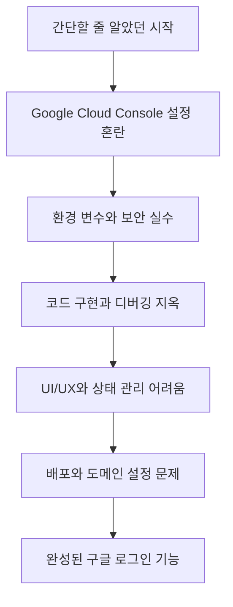

## Introduction

사이드 프로젝트를 만들면서 "구글 로그인 기능도 추가해볼까?" 하고 생각했습니다.

_"구글 로그인? 그냥 버튼 하나 만들고 API 몇 개 호출하면 되는 거 아닐까?"_

당시엔 몰랐지만 이 생각이 얼마나 많은 배움의 시작이 될지. OAuth 2.0이라는 단어를 처음 마주했을 때부터 시작된 여정에서 정말 많은 것들을 배웠습니다. Google Cloud Console에서 헤매고, 환경 변수를 깃에 올릴 뻔하고, 팝업이 안 뜨는 이유를 몰라 고생했던 경험들이 지금은 소중한 학습 과정이 되었습니다.

> "생각보다 복잡했지만... 하나씩 해결해 나갔어요!"

이 글은 주니어 개발자분들이 구글 로그인 구현 시 겪을 수 있는 시행착오를 조금 덜 경험하시길 바라는 마음으로 작성했습니다. **Svelte/SvelteKit** 환경에서 구현한 실제 코드와 함께, 어떤 선택을 했고 어떤 문제에 부딪혔는지 솔직하게 공유합니다.

## 1. 시행착오 1 - Google Cloud Console 설정의 혼란

구글링을 통해 "구글 로그인 구현"을 검색했을 때 나온 첫 단계는 **Google Cloud Console**에서 OAuth 2.0 클라이언트 ID 생성이었습니다. 하지만 예상보다 과정이 많았습니다.

### 실수 1: OAuth 동의 화면을 대충 설정
OAuth 동의 화면 설정에서 "내부용"과 "외부용" 중 선택을 잘못했습니다. 개인 프로젝트나 공개 서비스는 **"외부용"**을 선택해야 합니다.

### 실수 2: Redirect URI를 잘못 설정
가장 큰 문제는 **승인된 리디렉션 URI** 설정이었습니다. 포트 번호, 슬래시 하나까지도 틀리면 `redirect_uri_mismatch` 에러가 발생합니다.

처음 설정:
```
http://localhost:3000/callback
```

올바른 설정:
```
http://localhost:5173          # Vite 개발 서버
https://cvfactory.dev          # 프로덕션 도메인
```

### 해결 과정: 체계적으로 다시 설정
몇 시간의 삽질 끝에 올바른 설정 방법을 찾았습니다.

#### 1단계: 프로젝트 생성 및 API 활성화
- Google Cloud Console에서 새 프로젝트를 만들고, 'Google Identity Services API'를 활성화합니다.

#### 2단계: OAuth 동의 화면 설정
```yaml
애플리케이션 이름: CV Factory
사용자 지원 이메일: your-email@gmail.com
승인된 도메인: cvfactory.dev (프로덕션용)
```

#### 3단계: OAuth 2.0 클라이언트 ID 생성
```yaml
애플리케이션 유형: 웹 애플리케이션
이름: Web Client
승인된 JavaScript 원본:
  - http://localhost:5173
  - https://cvfactory.dev
승인된 리디렉션 URI:
  - http://localhost:5173
  - https://cvfactory.dev
```

설정이 완료되면 **클라이언트 ID**와 **클라이언트 보안 비밀**을 얻게 됩니다. **중요**: 클라이언트 보안 비밀은 프론트엔드에서 사용하지 않습니다.

## 2. 시행착오 2 - 환경 변수와 보안 실수

### 위험했던 순간: 클라이언트 시크릿을 프론트엔드에?
처음에는 클라이언트 ID와 시크릿 모두 프론트엔드 코드에서 사용해야 한다고 생각했습니다.

```javascript
// ❌ 절대 하면 안 되는 코드
const GOOGLE_CLIENT_SECRET = "GOCSPX-very-secret-key"; // 위험!
```
다행히 커밋하기 전에, 프론트엔드에서는 **Authorization Code Flow with PKCE**를 사용하므로 클라이언트 시크릿이 필요 없다는 사실을 알게 되었습니다.

### 실수 1: .env 파일을 깃에 올릴 뻔
환경 변수를 위해 `.env` 파일을 만들고 습관적으로 `git add .`을 했다가, 급하게 `git reset HEAD .env`로 취소했습니다. 민감 정보가 담긴 `.env.local` 같은 파일은 반드시 `.gitignore`에 추가해야 합니다.

### 실수 2: Vite의 `VITE_` 접두사 누락
Vite에서는 클라이언트 사이드에서 접근할 환경 변수에 `VITE_` 접두사를 붙여야 합니다. 이것을 몰라 `import.meta.env.GOOGLE_OAUTH_CLIENT_ID`가 계속 `undefined`가 나왔습니다.

#### 올바른 환경 변수 설정 및 사용
```bash
# .env.local (gitignore 필수)
VITE_GOOGLE_OAUTH_CLIENT_ID=123456789-abc.apps.googleusercontent.com
```

```typescript
// lib/google-auth.ts
const CLIENT_ID = import.meta.env.VITE_GOOGLE_OAUTH_CLIENT_ID;

// 환경 변수가 없을 때 에러 처리
if (!CLIENT_ID) {
  throw new Error("VITE_GOOGLE_OAUTH_CLIENT_ID가 설정되지 않았습니다.");
}
```

## 3. 시행착오 3 - 코드 구현과 디버깅 지옥

### 실수 1: Google API 스크립트 로딩 타이밍
SvelteKit에서는 스크립트가 로드되기 전에 컴포넌트가 마운트될 수 있어, **동적으로 스크립트를 로드**하는 방법이 안정적입니다.

```typescript
// ✅ 동적 스크립트 로딩
private loadGoogleIdentityScript(): Promise<void> {
  return new Promise((resolve, reject) => {
    if (window.google?.accounts) {
      resolve();
      return;
    }
    const script = document.createElement('script');
    script.src = 'https://accounts.google.com/gsi/client';
    script.onload = () => resolve();
    script.onerror = () => reject(new Error('Google Identity Services 로드에 실패했습니다.'));
    document.head.appendChild(script);
  });
}
```

### 실수 2: 구식 API vs 신식 API
처음에는 `gapi.auth2`를 사용하려고 했는데, 이는 **deprecated**된 방법이었습니다. 2023년부터는 **Google Identity Services**를 사용해야 합니다.

### 실수 3: "토큰이 뭐지? 사용자 정보는 어떻게 가져오지?"
OAuth 플로우를 제대로 이해하지 못해 토큰을 받고 나서 뭘 해야 할지 몰랐습니다. **액세스 토큰으로 사용자 정보 API를 호출**해야 한다는 것을 나중에야 알았습니다.

```typescript
// ✅ 토큰으로 사용자 정보 가져오기
callback: async (response: any) => {
  if (response.error) {
    reject(new Error("구글 로그인에 실패했습니다."));
    return;
  }
  try {
    const userInfoResponse = await fetch(
      `https://www.googleapis.com/oauth2/v2/userinfo?access_token=${response.access_token}`
    );
    if (!userInfoResponse.ok) {
      throw new Error("사용자 정보를 가져오는데 실패했습니다.");
    }
    const userInfo = await userInfoResponse.json();
    resolve(userInfo);
  } catch (error) {
    reject(new Error("사용자 정보를 가져오는데 실패했습니다."));
  }
}
```

### 실수 4: 부실한 에러 처리
초기에는 모든 에러를 `console.error`로만 처리했습니다. 하지만 **팝업 차단**, **팝업 닫기**, **네트워크 오류** 등 각각에 대해 적절한 메시지를 보여주도록 개선했습니다.

```typescript
// ✅ 세분화된 에러 처리
error_callback: (error: any) => {
  if (error.type === "popup_closed") {
    reject(new Error("로그인이 취소되었습니다."));
  } else if (error.type === "popup_blocked") {
    reject(new Error("팝업이 차단되었습니다. 브라우저 설정을 확인해주세요."));
  } else {
    reject(new Error("구글 로그인에 실패했습니다. 다시 시도해주세요."));
  }
}
```

## 4. 시행착오 4 - UI/UX와 상태 관리의 어려움

### 실수 1: 상태 관리를 컴포넌트 내부에서만
처음에는 모든 상태를 컴포넌트 내부에서 관리하려고 했지만, 다른 컴포넌트에서 로그인 상태를 알 수 없는 문제가 있었습니다.

### 해결책: Svelte Store로 전역 상태 관리
**Svelte Store**를 사용하여 여러 컴포넌트에서 공유할 전역 상태(로그인 여부, 사용자 정보, 로딩 상태)를 관리했습니다.

```typescript
// lib/stores/auth.ts
import { writable } from "svelte/store";

function createAuthStore() {
  const { subscribe, set, update } = writable({
    isLoggedIn: false,
    user: null,
    isLoading: false,
    error: null,
  });

  return {
    subscribe,
    async login() { /* ... */ },
    async logout() { /* ... */ },
    async checkAuthStatus() { /* 페이지 로드 시 localStorage 확인 */ },
  };
}

export const authStore = createAuthStore();
```

### 완성된 GoogleAuthButton 컴포넌트 예시
여러 상태(로딩, 에러, 로그인 후)를 고려하여 컴포넌트를 구성했습니다.

```svelte
<!-- lib/components/GoogleAuthButton.svelte -->
<script lang="ts">
  import { authStore } from '../stores/auth.js';
  // ... (생략) ...
</script>

<div class="auth-container">
  {#if $authStore.isLoggedIn && $authStore.user}
    <!-- 로그인된 상태: 프로필 이미지, 이름, 드롭다운 메뉴 -->
  {:else}
    <!-- 로그인되지 않은 상태: 구글 로그인 버튼 -->
    <button class="login-button" on:click={() => authStore.login()} disabled={$authStore.isLoading}>
      {#if $authStore.isLoading}
        <div class="spinner"></div>
        <span>로그인 중...</span>
      {:else}
        <span>구글로 로그인</span>
      {/if}
    </button>
  {/if}

  {#if $authStore.error}
    <div class="error-message">{$authStore.error}</div>
  {/if}
</div>

<style>
  .spinner {
    border: 2px solid #f3f3f3;
    border-top: 2px solid #3c4043;
    border-radius: 50%;
    width: 16px;
    height: 16px;
    animation: spin 1s linear infinite;
  }
  @keyframes spin { 0% { transform: rotate(0deg); } 100% { transform: rotate(360deg); } }
</style>
```

## 5. 시행착오 5 - 배포와 도메인 설정 문제

### 클래식한 문제: "로컬에서는 되는데..."
배포 후 `redirect_uri_mismatch` 에러가 발생했습니다.

### 실수 1: 프로덕션 도메인을 Google Cloud Console에 등록 안 함
로컬에서만 테스트하다 보니 `http://localhost:5173`만 등록해두고 실제 프로덕션 도메인은 깜빡했습니다. 배포할 도메인도 반드시 추가해야 합니다.

### 실수 2: 환경 변수를 배포 플랫폼에 설정 안 함
`.env` 파일은 배포 서버에 자동으로 올라가지 않습니다. 사용하는 배포 플랫폼(Vercel, Netlify 등)에 맞게 환경 변수를 별도로 설정해야 합니다.

### 실수 3: 캐시 문제
환경 변수를 수정하고 재배포했는데도 여전히 이전 값이 사용되는 경우가 있었습니다. 이는 빌드 캐시 때문이었으며, 캐시를 클리어하고 재배포하여 해결했습니다.

## Conclusion

구글 로그인 하나를 구현하는 과정은 단순한 기능 추가가 아니었습니다. OAuth 2.0, 보안, 비동기 처리, 상태 관리, 배포 등 웹 개발의 핵심적인 부분들을 깊이 있게 학습하는 계기가 되었습니다.



### 가장 큰 깨달음들

1.  **"문서를 읽자"**: 급하게 구현하려다가 더 오래 걸렸습니다. 공식 문서를 차근차근 읽었다면 많은 시행착오를 줄일 수 있었을 것입니다.
2.  **"보안은 처음부터"**: 클라이언트 시크릿 노출, .env 파일 커밋 등 보안 실수는 프로젝트 초기에 바로잡아야 합니다.
3.  **"사용자 관점에서 생각하기"**: 개발자 환경이 아닌, 실제 사용자의 다양한 환경(팝업 차단, 느린 네트워크 등)을 고려해야 합니다.

이 글이 나와 같은 주니어 개발자들에게 도움이 되길 바랍니다. 실수를 두려워하지 말고, 실수에서 배우고 성장하는 것이 중요합니다.

---

### 참고 자료

- [Google Identity Services 공식 문서](https://developers.google.com/identity/gsi/web/guides/overview)
- [OAuth 2.0 RFC](https://tools.ietf.org/html/rfc6749)
- [SvelteKit 공식 문서](https://kit.svelte.dev/)
- [Vite 환경 변수 가이드](https://vitejs.dev/guide/env-and-mode.html)