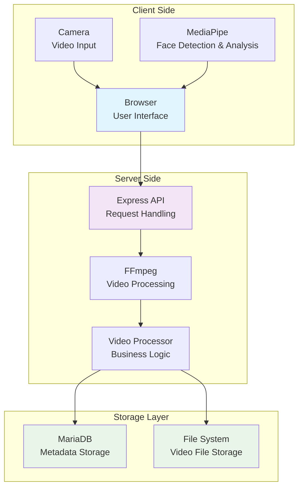
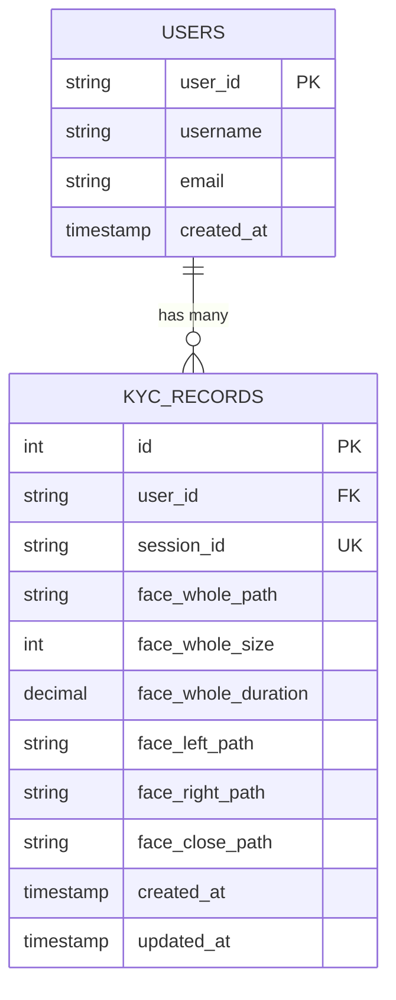

Based on the Yaw angle measurement technology resolved in the last post, I completed the core functions of the KYC system. From video splitting using FFmpeg and MariaDB integration to performance optimization - I share a junior developer's full-stack challenge.

## 🎯 From Problem Solving to Feature Completion: Implementing the KYC Process

In my last post, I shared the struggles of improving Yaw angle measurement accuracy. This time, those efforts have paid off, and I've been focused on completing the core functionality of the KYC (Know Your Customer) system based on the resolved technology.

### KYC Process Workflow

The KYC process follows a structured workflow:

```mermaid
flowchart TD
    A[Start KYC Process] --> B[Initialize Camera]
    B --> C[Face Detection]
    C --> D{Face Detected?}
    D -->|No| C
    D -->|Yes| E[Yaw Angle Check]
    E --> F{Angle Range?}
    F -->|±10°| G[Capture Front Video]
    F -->|-30° ~ -15°| H[Capture Left Video]
    F -->|+15° ~ +30°| I[Capture Right Video]
    F -->|Invalid| E
    G --> J{All Steps Complete?}
    H --> J
    I --> J
    J -->|No| E
    J -->|Yes| K[Upload to Server]
    K --> L[Video Splitting]
    L --> M[Store in MariaDB]
    M --> N[KYC Complete]
```



I started by applying the **Yaw angle measurement logic**, which was last week's biggest achievement, to the actual KYC process. I removed the `Math.random()` function that remained in the initial code and refined the calculation logic based on actual **MediaPipe** landmark data. Thanks to this, angles are now accurately measured in real-time according to the direction the user turns their head, and I was able to create robust logic for proceeding to the next step based on this.

### Configuration Values:
- **Front**: When yaw angle is within ±10°
- **Left**: When yaw angle is within −30° ~ −15°
- **Right**: When yaw angle is within +15° ~ +30°

I completed a workflow that automatically captures video for each step when conditions are met and proceeds to the next step.

### Angle Detection System

The angle detection system uses MediaPipe landmarks for precise calculation:

```mermaid
flowchart LR
    A[MediaPipe Landmarks<br/>Nose Tip: Point 1<br/>Left Eye: Point 33<br/>Right Eye: Point 263] --> B[Calculate Nose Offset]
    B --> C[Yaw Angle Calculation]
    C --> D{Angle Classification}
    D -->|±10°| E[Front Position]
    D -->|-30° ~ -15°| F[Left Position]
    D -->|+15° ~ +30°| G[Right Position]
    D -->|Other| H[Invalid Position]
    
    style A fill:#e3f2fd
    style E fill:#c8e6c9
    style F fill:#c8e6c9
    style G fill:#c8e6c9
    style H fill:#ffcdd2
```



```javascript
// Yaw angle calculation logic in face-detection.js
calculateAngles(landmarks) {
    if (!landmarks || landmarks.length === 0) {
        return { yaw: 0, pitch: 0, roll: 0 };
    }

    // Actual angle calculation using MediaPipe landmarks
    const noseTip = landmarks[1];  // Nose tip
    const leftEye = landmarks[33]; // Left eye
    const rightEye = landmarks[263]; // Right eye
    
    // Yaw angle calculation (left/right rotation)
    const eyeDistance = Math.abs(leftEye.x - rightEye.x);
    const noseOffset = (noseTip.x - (leftEye.x + rightEye.x) / 2);
    const yaw = Math.atan2(noseOffset, eyeDistance) * (180 / Math.PI);
    
    return { yaw, pitch: 0, roll: 0 };
}
```

## ⚙️ Video Splitting and MariaDB Storage System Implementation

I focused on implementing the **video data storage** logic, which is the core of the KYC process. Initially, I considered storing the entire video on the server and then splitting it, but I changed the strategy thinking that pre-splitting by stages on the client side would be better in terms of computational efficiency. However, I ultimately adopted the approach of splitting on the server side.

### System Architecture

The system is organized into three main layers:



I used the **fluent-ffmpeg** library on the server side to split the entire KYC video received from the client into stages. Initially, I encountered 500 errors due to FFmpeg environment variable configuration issues, but I resolved the problem by registering the correct path to PATH.

```javascript
// Video splitting using fluent-ffmpeg
ffmpeg(videoPath)
  .setStartTime(startTime)
  .setDuration(duration)
  .output(outputPath)
  .on('end', () => console.log('Video segment created successfully.'))
  .on('error', (err) => console.error('Error processing video:', err))
  .run();
```

### FFmpeg Environment Setup Resolution

To resolve FFmpeg path configuration issues in a Windows environment, I implemented the following logic:

```javascript
// Automatic FFmpeg path setting in server.js
if (process.platform === 'win32' && !process.env.FFMPEG_PATH) {
    const username = os.userInfo().username;
    const ffmpegPath = `C:\\Users\\${username}\\AppData\\Local\\Microsoft\\WinGet\\Packages\\Gyan.FFmpeg_Microsoft.Winget.Source_8wekyb3d8bbwe\\ffmpeg-7.1.1-full_build\\bin\\ffmpeg.exe`;

    try {
        require('fs').accessSync(ffmpegPath);
        process.env.FFMPEG_PATH = ffmpegPath;
        console.log('🎬 FFmpeg path set:', ffmpegPath);
    } catch (error) {
        console.warn('⚠️ FFmpeg path not found. Searching in system PATH.');
    }
}
```

To systematically manage KYC data, I integrated **MariaDB**. Instead of storing video files directly in the DB using BLOB format, I improved efficiency by storing only file paths.

```sql
CREATE TABLE kyc_records (
    id INT AUTO_INCREMENT PRIMARY KEY,
    user_id VARCHAR(255) NOT NULL,
    session_id VARCHAR(100) NOT NULL UNIQUE,
    
    -- Whole video (store only file path)
    face_whole_path VARCHAR(500),
    face_whole_size INT,
    face_whole_duration DECIMAL(10,3),
    
    -- Step-by-step video (store only file path)
    face_left_path VARCHAR(500),
    face_right_path VARCHAR(500),
    face_close_path VARCHAR(500),
    
    created_at TIMESTAMP DEFAULT CURRENT_TIMESTAMP,
    updated_at TIMESTAMP DEFAULT CURRENT_TIMESTAMP ON UPDATE CURRENT_TIMESTAMP
);
```

This minimized the database size and made it easier to implement additional features like video streaming in the future.

### Database Schema Design

The database consists of two main tables:



## 📈 Performance Optimization and Maintainability Improvement

To enhance the system's completeness, I conducted overall performance optimization and code improvement work. I replaced unnecessary popup animations and complex UI with simple text guides, and removed unnecessary repetitive operations to solve intermittent performance degradation issues.

### Real-time Processing Optimization

```javascript
// Performance optimization in face-detection.js
class FaceDetector {
    constructor() {
        // Configuration for performance optimization
        this.lastProcessTime = 0;
        this.minProcessInterval = 33; // 30fps (33ms)
        this.isProcessing = false;
        
        // Inference statistics
        this.inferenceStats = {
            totalInferences: 0,
            totalProcessingTime: 0,
            averageProcessingTime: 0,
            lastInferenceTime: 0,
            errorCount: 0
        };
    }
    
    async detectFaces(videoElementOrImageData) {
        // Skip if processing or minimum interval hasn't passed
        const now = performance.now();
        if (this.isProcessing || (now - this.lastProcessTime) < this.minProcessInterval) {
            return this.lastResults;
        }
        
        this.isProcessing = true;
        this.lastProcessTime = now;
        
        // Actual face detection logic...
    }
}
```

### Video Recording System Improvement

I implemented fallback options for browser compatibility to ensure stable operation in various environments:

```javascript
// Browser compatibility handling in video-recorder.js
class VideoRecorder {
    constructor() {
        // Fallback options for browser compatibility
        this.fallbackOptions = [
            'video/webm;codecs=vp9',
            'video/webm;codecs=vp8', 
            'video/webm',
            'video/mp4'
        ];
    }
    
    getSupportedMimeType() {
        for (const mimeType of this.fallbackOptions) {
            if (MediaRecorder.isTypeSupported(mimeType)) {
                console.log(`✅ Supported MIME type: ${mimeType}`);
                return mimeType;
            }
        }
        console.warn('⚠️ No supported video MIME type found. Using default');
        return 'video/webm';
    }
}
```

## 📊 Current Status and Next Goals

Through two weeks of effort, I successfully completed the core prototype of the KYC system.

### ✅ Completed Features
- **Step-by-step KYC workflow based on Yaw angles**: Accurate angle measurement using MediaPipe landmarks
- **Video splitting and storage using Fluent-ffmpeg**: Efficient video processing on the server side
- **MariaDB integration and file path-based data management**: Performance optimization by storing paths instead of BLOBs
- **Intuitive user interface improvements**: Removal and simplification of complex animations
- **Browser compatibility and performance optimization**: Stable operation in various environments

### Development Progress Timeline

```mermaid
gantt
    title KYC System Development Timeline
    dateFormat  YYYY-MM-DD
    section Foundation
    Yaw Angle Research           :done, research, 2025-07-14, 2025-07-20
    MediaPipe Integration        :done, mediapipe, 2025-07-16, 2025-07-20
    Basic Face Detection         :done, detection, 2025-07-18, 2025-07-20
    
    section Core Logic
    Angle Calculation Logic      :done, calc, 2025-07-21, 2025-07-27
    Real-time Processing         :done, realtime, 2025-07-23, 2025-07-27
    Performance Issues           :done, perf1, 2025-07-25, 2025-07-27
    
    section Video Processing
    Video Recording System       :done, recording, 2025-07-28, 2025-08-03
    FFmpeg Integration          :done, ffmpeg, 2025-07-30, 2025-08-03
    Server-side Processing      :done, server, 2025-08-01, 2025-08-03
    
    section Database & Optimization
    MariaDB Integration         :done, db, 2025-08-04, 2025-08-10
    File Path Storage           :done, storage, 2025-08-06, 2025-08-10
    System Optimization         :done, opt, 2025-08-08, 2025-08-10
    
    section Future Plans
    ID Card Recognition         :future, id, 2025-08-11, 2025-08-17
    Face Comparison             :future, compare, 2025-08-14, 2025-08-20
    Advanced Features           :future, advanced, 2025-08-18, 2025-08-24
```

### 🎯 Next Goals

The next goal is to implement **ID card recognition** and **face comparison with the user's face** logic based on the now-completed prototype. I plan to challenge advanced features that analyze specific facial parts (eyes, nose, mouth) and compare ID card photos with real-time captured videos.

Through this project, I deeply realized the importance of **system design considering actual operational environments** beyond simple feature implementation. I was able to grow one step further by solving various technical challenges encountered in practice, especially performance optimization, browser compatibility, and data storage strategies.

---

**Tags**: #KYC #database #ffmpeg #performance-optimization #MediaPipe #MariaDB #fluent-ffmpeg #video-processing #face-detection #web-development