## Introduction

Building a KYC (Know Your Customer) authentication system seemed straightforward—until production hit. What started as a simple bug fix turned into a three-day journey through database schemas, system libraries, network configurations, and infrastructure overhaul. This is the practical guide I wish I had before diving into the multi-layer debugging nightmare.

## 1. The Initial Crisis: Test Environment Collapse

### When the Foundation Crumbles

My tests were failing, but not for the reasons you'd expect. The issues were stacked like a house of cards:

| Problem | Symptom | Root Cause |
|---------|---------|------------|
| Database errors | `Table 'face_similarities' doesn't exist` | Migration script never ran |
| Computer vision crashes | `libGL.so.1: cannot open shared object file` | Missing system dependencies |
| GPU processing failure | ONNX Runtime initialization failed | Incorrect environment variables |

### The Quick Fix That Wasn't

```bash
# Database migration - the obvious first step
uv run alembic upgrade head

# System dependencies - the hidden requirement
sudo apt-get update && sudo apt-get install -y \
    libgl1-mesa-glx \
    libglib2.0-0 \
    libsm6 \
    libxext6 \
    libxrender-dev

# GPU environment configuration
export ONNX_PROVIDERS=CudaExecutionProvider,CPUExecutionProvider
export CUDA_VISIBLE_DEVICES=0
```

**Lesson learned**: Always verify your entire tech stack, not just your application code.

---

## 2. The Production Paradox: Tests Pass, Reality Fails

### The Silent Killer

My test suite showed green across the board:
```
==================== test session starts ====================
collected 15 items
tests/test_api_endpoints.py .....                          [100%]
==================== 15 passed in 2.3s ====================
```

But in production? Complete failure. Users couldn't get past the identity document upload step.

### Debugging the Invisible

The issue was a communication breakdown between frontend and backend:

```mermaid
sequenceDiagram
    participant U as User
    participant F as Frontend (React)
    participant P as Proxy
    participant B as Backend (FastAPI)

    U->>F: Captures ID document
    F->>F: kycApi.uploadImage()
    Note over F: ⚠️ Request hangs here
    F-xP: Request never reaches
    P-xB: Backend never called
    U->>U: "App is frozen"
```



### The Network Configuration Maze

After three days of network sleuthing, I discovered two critical issues:

1. **ENUM Case Sensitivity**: My database stored `video` but the code expected `Video`
2. **IPv6/IPv4 Conflict**: Mixed resolution causing request timeouts

```yaml
# docker-compose.yml - The fix
services:
  frontend:
    environment:
      - VITE_API_URL=http://127.0.0.1:8000  # Force IPv4
      - NODE_ENV=production
    extra_hosts:
      - "host.docker.internal:host-gateway"
```

---

## 3. The Infrastructure Revolution: Windows to WSL

### The Permission Loop from Hell

Every Docker restart brought the same nightmare:
```
PermissionError: [Errno 13] Permission denied: 'uploads/images'
```

Windows file permissions were fighting Linux Docker containers. And Windows was losing.

### The WSL Gambit

I made the bold decision to migrate my entire development environment:

```bash
# Step 1: Enable WSL2
wsl --install -d Ubuntu-24.04

# Step 2: Configure for Docker
echo "[wsl2]" > ~/.wslconfig
echo "memory=4GB" >> ~/.wslconfig
echo "processors=2" >> ~/.wslconfig

# Step 3: Mount with proper permissions
sudo mount -t drvfs '\\wsl$\Ubuntu-24.04' /mnt/wsl
```

### The Before and After

| Aspect | Windows | WSL2 |
|--------|---------|------|
| File I/O Performance | ~100MB/s | ~500MB/s |
| Docker Compatibility | Partial | Native |
| Permission Issues | Constant | None |
| Development Experience | Frustrating | Smooth |

---

## 4. The File Management Epiphany: Session-Based Architecture

### The Chaos Before

My file naming was inconsistent:
```
uploads/
├── user_123_card.jpg
├── video_session_456.mp4
├── result_789.json
└── random_upload.png
```

Matching identity documents with face videos became a guessing game.

### The Session-Based Revolution

I implemented a session-based file management system:

```python
# FastAPI Backend - Session Manager
class SessionFileManager:
    def __init__(self, session_id: str):
        self.session_id = session_id
        self.base_path = Path("uploads") / session_id

    def organize_files(self, file_type: str, file_data: bytes):
        """Organize files by session ID and type"""
        self.base_path.mkdir(exist_ok=True)

        file_mapping = {
            "id_card": f"{self.session_id}_card.jpg",
            "face_video": f"{self.session_id}_video.mp4",
            "result": f"{self.session_id}_result.json"
        }

        filename = file_mapping.get(file_type)
        if filename:
            (self.base_path / filename).write_bytes(file_data)

    def trigger_comparison(self):
        """Trigger face comparison when both files exist"""
        if self._has_both_files():
            celery_app.send_task(
                'compare_faces',
                args=[self.session_id]
            )
```

```javascript
// Frontend - Session Tracking
class KYCSession {
    constructor() {
        this.sessionId = this.generateUUID();
        this.files = new Map();
    }

    async uploadFile(type, file) {
        const formData = new FormData();
        formData.append('file', file);
        formData.append('session_id', this.sessionId);
        formData.append('type', type);

        const response = await fetch('/api/upload', {
            method: 'POST',
            body: formData
        });

        this.files.set(type, file.name);
        this.checkReadyForComparison();
    }

    checkReadyForComparison() {
        if (this.files.has('id_card') && this.files.has('face_video')) {
            this.notifyReady();
        }
    }
}
```

---

## 5. The Monitoring Overhaul: Observability Matters

### Before: Flying Blind

I had no visibility into the process flow. Users would complain, and I'd have to manually check logs.

### After: Complete Observability

```python
# Structured Logging with Context
import structlog
logger = structlog.get_logger()

@celery_app.task(bind=True)
def process_kyc_comparison(self, session_id: str):
    """Process face comparison with full logging"""

    with logger.bind(session_id=session_id, task_id=self.request.id):
        logger.info("Starting face comparison process")

        try:
            # Load files
            id_card_path = get_file_path(session_id, "id_card")
            video_path = get_file_path(session_id, "face_video")

            logger.info("Files loaded",
                       id_card=id_card_path,
                       video=video_path)

            # Extract faces
            card_face = extract_face_from_document(id_card_path)
            video_face = extract_face_from_video(video_path)

            logger.info("Faces extracted",
                       card_face_confidence=card_face.confidence,
                       video_face_confidence=video_face.confidence)

            # Compare faces
            similarity = compare_embeddings(card_face.embedding,
                                           video_face.embedding)

            logger.info("Comparison complete",
                       similarity_score=similarity)

            # Save result
            save_result(session_id, {
                "similarity": similarity,
                "verified": similarity > 0.8,
                "processed_at": datetime.utcnow()
            })

        except Exception as e:
            logger.error("Processing failed", error=str(e))
            raise
```

---

## 6. The CI/CD Pipeline: Preventing Regression

### Automated Testing Stack

```yaml
# .github/workflows/kyc-e2e.yml
name: KYC End-to-End Tests

on:
  push:
    paths:
      - 'Fastapi_worker/**'
      - 'Reactts_frontend/**'

jobs:
  test-kyc-flow:
    runs-on: ubuntu-latest

    services:
      mariadb:
        image: mariadb:10.11
        env:
          MYSQL_ROOT_PASSWORD: test
        options: >-
          --health-cmd="mysqladmin ping"
          --health-interval=10s
          --health-timeout=5s
          --health-retries=3

      redis:
        image: redis:7
        options: >-
          --health-cmd="redis-cli ping"
          --health-interval=10s

    steps:
      - uses: actions/checkout@v4

      - name: Setup Python
        uses: actions/setup-python@v4
        with:
          python-version: '3.11'

      - name: Install dependencies
        run: |
          cd Fastapi_worker
          pip install -e .

      - name: Run migrations
        run: |
          cd Fastapi_worker
          alembic upgrade head

      - name: Start backend
        run: |
          cd Fastapi_worker
          uv run uvicorn app.main:app --host 0.0.0.0 --port 8000 &

      - name: Start frontend
        run: |
          cd Reactts_frontend
          npm ci
          npm run dev &

      - name: Run E2E tests
        run: |
          cd Fastapi_worker
          pytest tests/test_e2e_kyc_flow.py -v
```

---

## 7. The Decision Framework: When to Dig Deep

### Quick Troubleshooting Checklist

| Symptom | Check First | Deep Dive If |
|---------|------------|--------------|
| Uploads failing | File permissions | Docker volume mount configuration |
| API timeouts | Network connectivity | Host resolution (IPv4/IPv6) |
| CV crashes | Library versions | System dependencies |
| Database errors | Connection string | Migration status |

### Infrastructure Red Flags 🚨

- **Permission errors on every restart** → Check file system compatibility
- **Works in dev, fails in prod** → Check environment variables
- **Tests pass, reality fails** → Check network configuration
- **Random intermittent failures** → Check resource constraints

---

## Conclusion

Debugging production systems is never just about code—it's about understanding the entire stack from the metal up. My journey through database schemas, system libraries, network configurations, and infrastructure taught me valuable lessons:

1. **Environment consistency is non-negotiable** - Dev, test, and prod must match
2. **Observability is not optional** - You can't fix what you can't see
3. **Infrastructure decisions have long-term consequences** - Choose wisely
4. **Automated testing must mirror reality** - Otherwise it's just false confidence

The KYC system is now stable, processing thousands of verifications daily. But more importantly, I have the tools and processes to handle whatever comes next.

### Key Takeaways

```bash
# My debugging mantra
1. Check the foundation first (DB, migrations, system libs)
2. Verify the network (host resolution, protocols)
3. Validate the environment (variables, permissions)
4. Observe everything (logs, metrics, traces)
5. Automate the fixes (CI/CD, infrastructure as code)
```

Remember: The bug is rarely where you think it is. Always look one layer deeper.

## Additional Resources

- [WSL2 Best Practices](https://learn.microsoft.com/en-us/windows/wsl/setup/environment)
- [Docker in WSL2 Performance Guide](https://docs.docker.com/desktop/wsl/)
- [FastAPI Production Checklist](https://fastapi.tiangolo.com/tutorial/production/)
- [Systematic Debugging Methodology](https://debuggingbook.org/)
