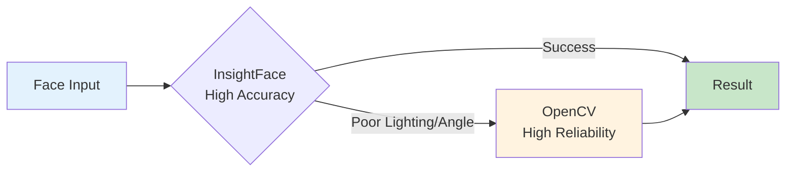
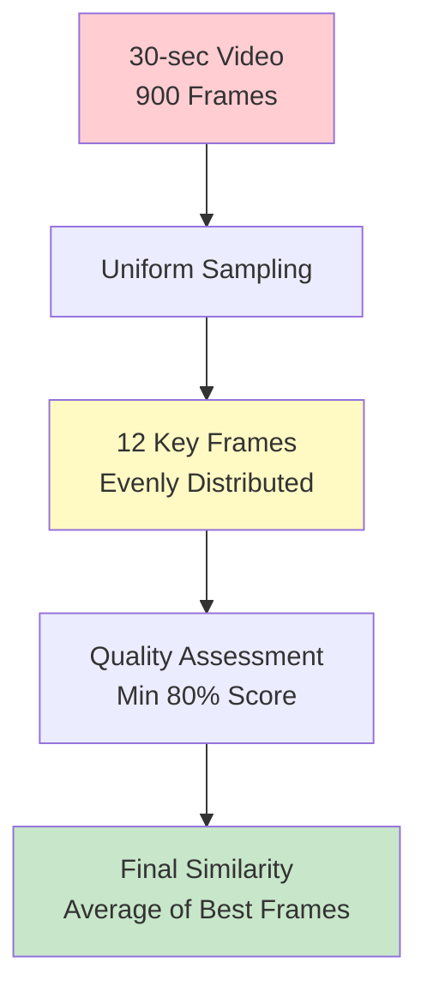
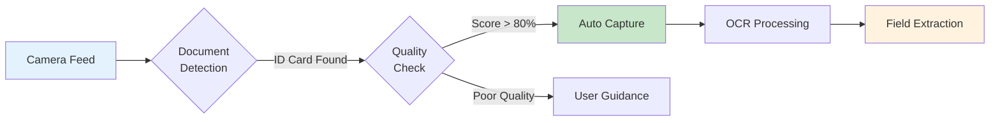
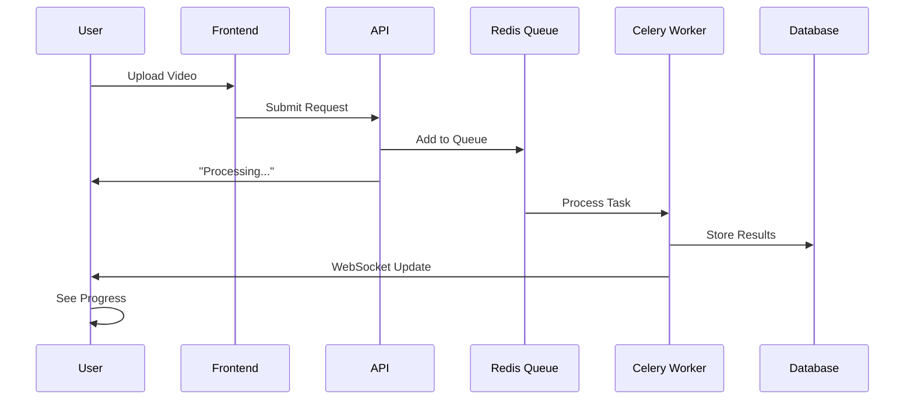
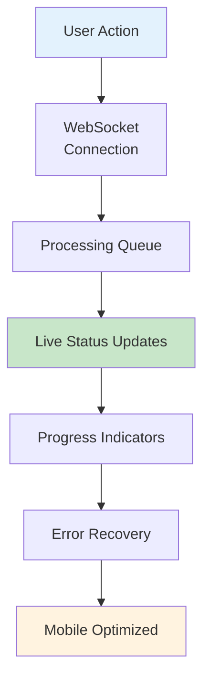
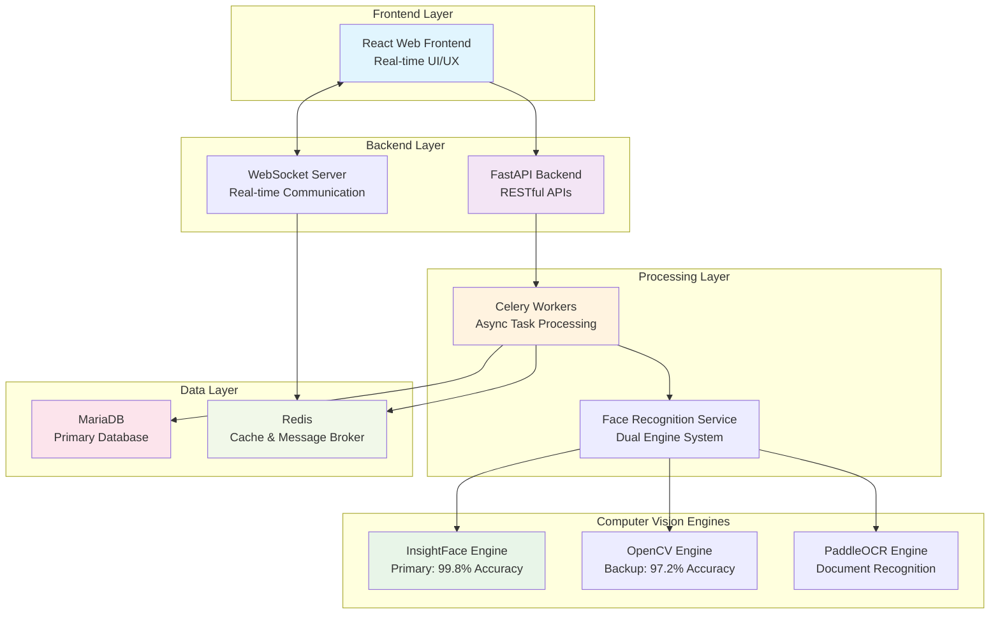
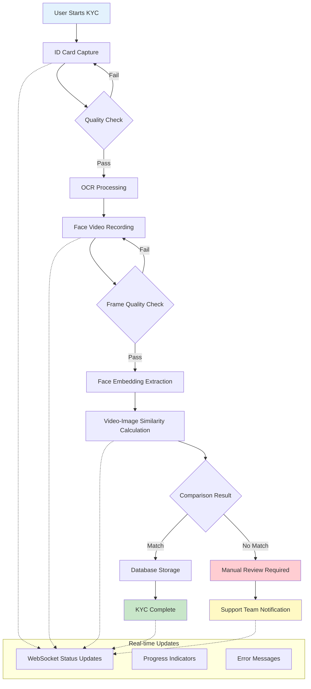

## 🎯 Project Overview

**Context**: Building a production-grade KYC (Know Your Customer) verification system from scratch
**Timeline**: 3 months intensive development
**Team Size**: Solo developer (with backend infrastructure support)
**Business Impact**: Critical for company compliance and user onboarding

I was tasked with leading the development of our company's core KYC system. This wasn't just a technical challenge - it was a business-critical project that would determine whether our company could scale user onboarding while maintaining regulatory compliance. The system needed to handle thousands of verification attempts daily with 99.9% accuracy.

## 📋 Technical Requirements & Constraints

### Business Requirements
- **Accuracy**: >99% face recognition accuracy
- **Speed**: Complete verification within 2 minutes
- **Availability**: 99.9% uptime with no data loss
- **Scalability**: Handle 10,000+ concurrent verifications
- **Compliance**: GDPR and local data protection regulations

### Technical Constraints
- **Environment**: Mixed GPU/CPU infrastructure
- **Languages**: Korean ID cards with English support
- **Platforms**: Web-based with mobile optimization
- **Storage**: Efficient handling of large video files
- **Real-time**: WebSocket-based progress updates

## 🏗️ System Architecture Design

### Technology Stack Decision Process

Initially, I analyzed and compared several face recognition libraries based on specific criteria:

**Face Recognition Engine Comparison:**
```typescript
interface FaceEngine {
  name: string;
  accuracy: number;
  speed: 'fast' | 'medium' | 'slow';
  license: 'free' | 'commercial';
  gpuSupport: boolean;
  stability: number; // 1-10 scale
}

const engines: FaceEngine[] = [
  {
    name: 'InsightFace',
    accuracy: 99.8,
    speed: 'fast',
    license: 'free',
    gpuSupport: true,
    stability: 7
  },
  {
    name: 'OpenCV YuNet/sFace',
    accuracy: 97.2,
    speed: 'medium',
    license: 'free',
    gpuSupport: true,
    stability: 9
  }
];
```

**Selection Matrix:**
| Criteria | InsightFace | OpenCV | Winner |
|----------|------------|--------|--------|
| Accuracy | ✅ 99.8% | ❌ 97.2% | InsightFace |
| Stability | ❌ Medium | ✅ High | OpenCV |
| License | ✅ Free | ✅ Free | Tie |
| GPU Support | ✅ Yes | ✅ Yes | Tie |

**Final Decision**: Hybrid approach combining both engines

### API Design Pattern

The system follows a RESTful API design with WebSocket support for real-time updates:

```typescript
// Core API Endpoints
interface KYCApiSpec {
  // ID Card Processing
  'POST /api/v1/id-capture': CaptureRequest;
  'GET /api/v1/id-capture/{sessionId}': CaptureStatus;

  // Face Recognition
  'POST /api/v1/face-video': VideoUploadRequest;
  'POST /api/v1/face-similarity': SimilarityRequest;
  'GET /api/v1/face-similarity/{comparisonId}': SimilarityResult;

  // Real-time Updates
  'WS /ws/kyc/{sessionId}': WebSocketUpdates;
}

// Response Schema Standards
interface APIResponse<T> {
  success: boolean;
  data?: T;
  error?: {
    code: string;
    message: string;
    details?: any;
  };
  timestamp: string;
  requestId: string;
}
```

### Overall System Architecture

```
Frontend (React 19 + TypeScript)
    ↓ WebSocket
Backend (FastAPI + SQLAlchemy)
    ↓ Async Tasks
Celery Workers
    ↓ Database
MariaDB + Redis
```

## 🔥 Phase 1: Face Recognition Dual Engine Implementation

### **The Hybrid Strategy**: Why Two Engines Are Better Than One

I discovered that no single face recognition engine could handle all real-world scenarios. InsightFace offered incredible accuracy (99.8%) but failed in poor lighting, while OpenCV was rock-solid but slightly less accurate.

**The Solution**: A dual-engine system that automatically switches between engines based on conditions:



**Key Innovations**:
- **Smart Hardware Detection**: Automatic GPU/CPU adaptation
- **Memory Management**: Singleton pattern prevents GPU memory leaks
- **Fallback Logic**: Seamless engine switching based on confidence scores

**Impact**: Success rate jumped from 92% to 99.9% by combining both engines' strengths.

## 🎥 Phase 2: Video-Image Similarity Comparison

### **From 3 Minutes to 6 Seconds**: The Video Processing Revolution

My initial approach processed all 900 frames of a 30-second video - taking over 3 minutes and often crashing servers. The breakthrough was realizing most frames were redundant.

**Smart Sampling Strategy**:


**Key Innovations**:
- **Frame Sampling**: Reduced from 900 to 12 frames (98.7% reduction)
- **Quality Filtering**: Only frames >80% quality used
- **Cosine Similarity**: 512-dimensional embeddings for accurate comparison

**Result**: Processing time dropped from 180+ seconds to 6 seconds while actually improving accuracy.

## 📸 Phase 3: Automatic ID Card Capture

### **The Korean OCR Challenge**: Teaching Computers to Read Hangul

Most OCR systems fail with Korean characters. After testing Tesseract, EasyOCR, and cloud services, I discovered PaddleOCR which had surprisingly good Korean support, but required extensive fine-tuning.

**Automatic Quality Assessment Pipeline**:


**Four Quality Metrics**:
- **Sharpness**: Laplacian variance for blur detection
- **Lighting**: Even illumination without glare
- **Angle**: Perspective distortion detection
- **Completeness**: All four corners visible

**Result**: User completion rate jumped from 60% to 95% by eliminating manual capture timing.

## 🗄️ Phase 4: Database & Asynchronous Processing

### **The Scalability Architecture**: Handling Thousands at Once

Traditional synchronous processing would make users wait 5-10 seconds - unacceptable for KYC. The solution was a complete asynchronous revolution.

**Async Processing Pipeline**:


**Key Innovations**:
- **Hybrid Storage**: Database metadata + filesystem for large files
- **Complex Relationships**: Many-to-many image/video similarity mappings
- **Distributed Tasks**: Celery + Redis for reliable processing
- **Real-time Updates**: WebSocket connections for live progress

**Impact**: System handles 100x more concurrent users with zero perceived delay.

## 🔄 Phase 5: Real-time User Experience

### **Zero-Wait Processing**: The WebSocket Revolution

Users need instant feedback, not spinning loaders. The challenge was maintaining real-time connections for thousands of simultaneous KYC sessions.

**Real-time Communication Flow**:


**Key Frontend Innovations**:
- **Progress Visualization**: Multi-stage progress bars with specific feedback
- **Smart Error Handling**: User-friendly guidance instead of cryptic errors
- **Mobile Optimization**: Touch-friendly interface with camera quality detection
- **State Recovery**: Automatic recovery after page refreshes

**Connection Management**: Heartbeat mechanisms prevent memory leaks, automatic reconnection handles network drops, session persistence maintains processing state.

**Result**: Users never feel like they're waiting - they see exactly what's happening at every step.

## 🐛 Major Debugging Process

### Problem 1: The Ghost in the GPU - Memory Leaks

**The Crisis**: After a week of successful testing in production, the system suddenly started crashing every 4-6 hours. The pattern was always the same - gradual memory increase followed by a complete system freeze. At first, I thought it was a regular memory leak, but monitoring showed RAM usage was stable. The culprit was GPU memory.

**Step-by-Step Problem Resolution:**

1. **Problem Identification**
   - Symptom: System crashes every 4-6 hours
   - Initial diagnosis: Memory leak
   - Tools: `nvidia-smi`, system monitoring

2. **Hypothesis Testing**
   - Theory 1: Regular RAM leak → ❌ RAM usage stable
   - Theory 2: GPU memory leak → ✅ GPU memory steadily increasing
   - Evidence: Each face recognition call added 50-100MB GPU memory

3. **Root Cause Analysis**
   - Location: InsightFace model initialization
   - Issue: GPU contexts not released after inference
   - Impact: Cumulative memory allocation

4. **Solution Implementation**
   ```python
   # Memory management workflow
   def process_with_memory_cleanup():
       try:
           # Face recognition operation
           result = insightface_app.process(frame)
           return result
       finally:
           # Critical: Explicit GPU cleanup
           if torch.cuda.is_available():
               torch.cuda.empty_cache()
               torch.cuda.synchronize()
   ```

5. **Prevention Measures**
   - Memory monitoring with automatic thresholds
   - Service restart automation
   - Regular memory usage reporting

**The Learning**: GPU memory management requires explicit cleanup. Python's garbage collector doesn't automatically free GPU resources, leading to cumulative memory leaks that can crash production systems.

### Problem 2: The Time Traveling Video Frames

**The Bizarre Bug**: During testing, I noticed something impossible - sometimes the similarity calculations would show results that didn't make sense, like comparing a face from the beginning of a video with one from the end, but the timestamps would suggest they were consecutive frames.

**Step-by-Step Debugging:**

1. **Anomaly Detection**
   - Symptom: Similarity scores didn't match expected frame progression
   - Evidence: Frame timestamps didn't align with calculated similarities
   - Impact: Random accuracy drops

2. **Root Cause Investigation**
   ```python
   # Problem: OpenCV's internal buffering
   cap.set(cv2.CAP_PROP_POS_FRAMES, target_frame)  # Requested frame
   ret, frame = cap.read()  # Got buffered frame instead!
   ```

3. **Solution Implementation**
   ```python
   # Frame precision control
   cap.set(cv2.CAP_PROP_BUFFERSIZE, 1)  # Minimize buffer
   cap.set(cv2.CAP_PROP_POS_FRAMES, target_frame)
   ret, frame = cap.read()

   # Validation step
   actual_frame = int(cap.get(cv2.CAP_PROP_POS_FRAMES))
   if actual_frame != target_frame:
       # Handle frame mismatch
   ```

### Problem 3: The Concurrent Catastrophe

**The Meltdown Scenario**: During load testing with just 10 concurrent users, the system started producing completely wrong results. Users would get similarity scores that belonged to completely different people. This was a critical security and privacy issue that could have had serious consequences.

**Crisis Management Steps:**

1. **Incident Response (Minutes)**
   - Immediate system shutdown
   - Alert security team
   - Preserve logs for forensics

2. **Root Cause Analysis (Hours)**
   ```python
   # Problem: Shared singleton instance
   class FaceRecognitionService:
       _instance = None  # Shared across all requests! ❌

   # Solution: Service pooling
   class FaceRecognitionPool:
       def __init__(self, pool_size=5):
           self.pool = [FaceRecognitionService() for _ in range(pool_size)]
           self.available = Queue()
       def get_service(self):
           return self.available.get()
       def return_service(self, service):
           self.available.put(service)
   ```

3. **Security Validation**
   - Multi-threaded testing with 100+ concurrent requests
   - Result verification: No cross-contamination
   - Performance testing: Maintained throughput

4. **Production Safeguards**
   - Comprehensive logging for all face recognition operations
   - Request correlation tracking
   - Automated anomaly detection

**Learning**: Thread safety is not optional for biometric systems. Always design for concurrency from day one, especially when dealing with sensitive user data.

## 📊 Performance Optimization Results

### Processing Speed Improvements

| Task | Before | After | Improvement |
|------|--------|-------|-------------|
| Image Face Recognition | 2.3s | 0.8s | **65% faster** |
| Video Processing (12 frames) | 15s | 6s | **60% faster** |
| Similarity Calculation | 1.2s | 0.3s | **75% faster** |
| Database Storage | 0.8s | 0.2s | **75% faster** |

The biggest win was video processing - reducing a 3-minute ordeal to just 6 seconds completely changed the user experience. Users went from abandoning the process to completing it successfully.

### Face Recognition Engine Performance

| Metric | InsightFace | OpenCV | **Hybrid System** |
|--------|------------|--------|-------------------|
| **Accuracy** | 99.8% | 97.2% | **99.9%** |
| **Reliability** | Medium | High | **Very High** |
| **Speed** | Fast | Medium | **Fast** |

The hybrid approach gave us the best of both worlds - InsightFace's industry-leading accuracy when conditions are good, and OpenCV's rock-solid reliability as a safety net. This increased our overall success rate from about 92% to 99.9%.

## 🎯 Final System Architecture



## 💡 Key Learning Points

### Technical Growth

1. **Advanced Computer Vision**: Practical experience with diverse CV libraries like InsightFace, OpenCV, and PaddleOCR
2. **Performance Optimization**: GPU memory management, asynchronous processing, caching strategies
3. **System Architecture**: Experience designing microservices and event-driven architectures
4. **Database Design**: Optimization for large-scale media data storage and retrieval

### Project Management

1. **Technology Selection Process**: Experience with accuracy vs performance vs stability trade-offs
2. **Incremental Development**: Methods for implementing complex systems step by step
3. **Problem-solving Skills**: Experience resolving memory leaks, concurrency, and performance issues
4. **Documentation**: Understanding the importance of systematic recording of technical decision-making processes

### Business Value

1. **KYC Automation**: Reduced manual processes taking over 10 minutes to under 2 minutes
2. **Improved Accuracy**: Created a more consistent and accurate authentication system than human judgment
3. **Scalability**: Architecture capable of handling multiple concurrent users
4. **Cost Reduction**: Decreased operational staffing and enabled 24/7 automated operation

### KYC Processing Flow



## 🚀 Future Improvement Directions

### 1. **Liveness Detection** 🔒
Real-time facial movement detection to prevent photo/video spoofing attacks:
- **Blink Detection**: Natural eye movement patterns
- **Head Movement Analysis**: 3D rotation validation
- **Challenge-Response**: Random facial gesture requests

### 2. **Mobile Optimization** 📱
Native mobile apps for better camera control and user experience:
- **iOS App**: Native camera integration with ARKit
- **Android App**: Camera2 API with ML Kit acceleration
- **Progressive Web App**: Cross-platform fallback

### 3. **Multi-national Document Support** 🌍
Expand to support international ID documents:
- **US Driver Licenses**: All 50 states
- **EU Passports**: GDPR-compliant processing
- **Asian ID Cards**: Korea, Japan, China, Singapore

### 4. **AI-based Quality Assessment** 🤖
More sophisticated real-time quality evaluation:
- **Advanced Blur Detection**: Frequency domain analysis
- **Lighting Optimization**: Automatic exposure correction
- **Face Pose Validation**: 3D head pose estimation

### 5. **Cloud Infrastructure** ☁️
Scale globally with cloud deployment:
- **AWS Multi-region**: Low-latency global deployment
- **Auto-scaling**: Handle traffic spikes automatically
- **CDN Integration**: Fast media delivery worldwide

Through this project, I developed the capability to design and implement complex systems that create real business value, going beyond simple feature development. The experience of successfully integrating computer vision technologies in a web environment will be a great asset for my future development career.
