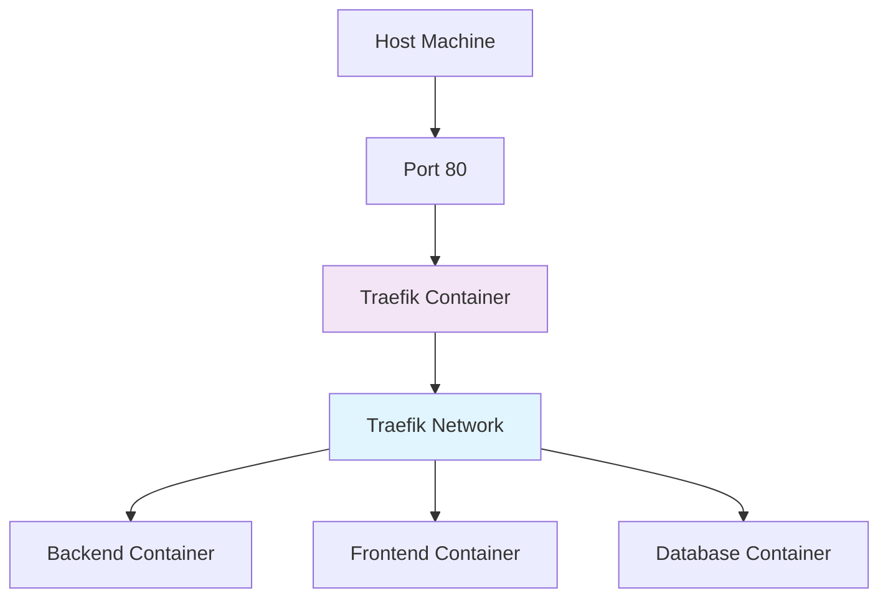
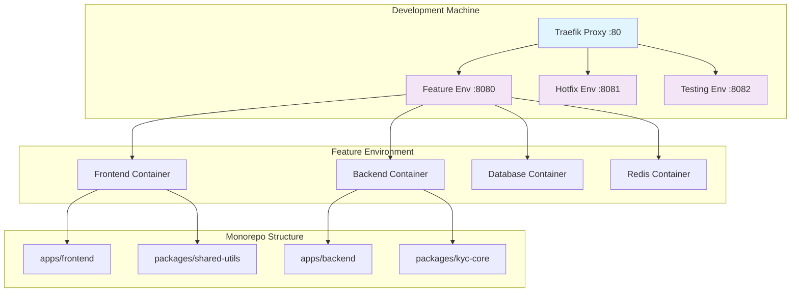

## Introduction

What started as a simple "let's optimize our development setup" turned into a complete infrastructure overhaul that would define our team's productivity for months to come. Our development environment was becoming a bottleneck—port conflicts, slow builds, and tangled dependencies were slowing us down. This is the story of how we migrated to Traefik-based centralized orchestration and Turborepo monorepo structure, and the painful lessons we learned along the way.

## 1. The Breaking Point: When Development Became a Nightmare

### The Daily Struggle

Every morning, our team would face the same ritual:

| Problem | Symptom | Time Wasted Daily |
|---------|---------|-------------------|
| Port conflicts | "Backend won't start, port 8000 is in use" | 15-30 minutes |
| Build bottlenecks | "Waiting for frontend build... again" | 20-45 minutes |
| Dependency hell | "Module not found: kyc_core.utils" | 10-20 minutes |
| Environment drift | "Works on my machine" issues | 30-60 minutes |

We were losing 1.5-2 hours daily to infrastructure issues. That's when I decided enough was enough.

### The Failed First Attempt

My initial approach was naive: "Let's just fix the port conflicts."

```bash
# The "quick fix" that made everything worse
docker-compose up -d --scale backend=2 --scale frontend=2
```

Result: Complete chaos. Services couldn't communicate, databases were conflicting, and our entire development environment collapsed.

**Lesson learned**: You can't solve systemic problems with band-aid solutions.

---

## 2. The Traefik Journey: From Port Hell to Orchestration Heaven

### The Research Phase

I spent days studying reverse proxy solutions:

| Solution | Pros | Cons |
|----------|------|------|
| Nginx | Stable, well-documented | Complex configuration, manual service discovery |
| HAProxy | High performance | Steep learning curve, not Docker-native |
| Traefik | Docker-native, automatic service discovery | Newer ecosystem, fewer tutorials |

We chose Traefik for its Docker-native approach and automatic service discovery.

### The First Traefik Implementation

```yaml
# Our initial traefik.yml - full of mistakes
version: '3.8'

services:
  traefik:
    image: traefik:v2.11
    ports:
      - "80:80"  # ❌ BAD: Conflicted with existing services
      - "8080:8080"  # ❌ BAD: Hardcoded port
    # ❌ MISSING: Network configuration
    # ❌ MISSING: Docker provider configuration
```

**Result**: Complete failure. Services couldn't communicate, and we broke our existing setup.

### The Breakthrough: Understanding Docker Networks

After days of debugging, I realized the core issue: we weren't thinking in Docker networks.



### The Working Traefik Configuration

```yaml
# The final working version
version: '3.8'

services:
  traefik:
    image: traefik:v2.11
    container_name: traefik-proxy
    command:
      - --api.dashboard=true
      - --providers.docker=true
      - --providers.docker.exposedbydefault=false
      - --providers.docker.network=traefik_proxy
      - --providers.file.filename=/etc/traefik/dynamic.yml
      - --entrypoints.web.address=:80
      - --entrypoints.websecure.address=:443
      - --log.level=DEBUG
    ports:
      - 80:80
      - 443:443
    volumes:
      - /var/run/docker.sock:/var/run/docker.sock:ro
      - ./certs:/etc/traefik/certs:ro
      - ./traefik_dynamic.yml:/etc/traefik/dynamic.yml:ro
    networks:
      - traefik_proxy
    labels:
      - traefik.enable=true
      - traefik.http.routers.traefik.rule=Host("traefik.127.0.0.1.sslip.io")
      - traefik.http.routers.traefik.entrypoints=web
      - traefik.http.routers.traefik.service=api@internal
    restart: unless-stopped

networks:
  traefik_proxy:
    external: true
    name: traefik_proxy
```

**Key breakthrough**: Creating the network as `external` and having services join it, rather than defining it inline.

### The Parallel Development Revolution

With Traefik in place, we could finally run multiple environments simultaneously:

```bash
# Environment 1: Feature branch
docker-compose -f docker-compose.feature.yml up -d

# Environment 2: Hotfix branch  
docker-compose -f docker-compose.hotfix.yml up -d

# Environment 3: Testing branch
docker-compose -f docker-compose.testing.yml up -d
```

Each environment had its own subdomain, no port conflicts, and complete isolation.

---

## 3. The Turborepo Migration: From Submodule Hell to Monorepo Heaven

### The Submodule Nightmare

Our old structure was a mess of Git submodules:

```
project-root/
├── backend/ (git submodule)
├── frontend/ (git submodule)  
├── shared-utils/ (git submodule)
└── kyc-core/ (git submodule)
```

**Daily problems**:
- Submodule sync failures: `fatal: reference is not a tree`
- Dependency version conflicts
- No shared build pipeline
- Impossible to run cross-service tests

### The Turborepo Research

I evaluated several monorepo solutions:

| Tool | Learning Curve | Build Performance | Ecosystem |
|------|----------------|-------------------|-----------|
| Lerna | High | Medium | Mature |
| Nx | Very High | Excellent | Complex |
| Turborepo | Medium | Excellent | Growing |

We chose Turborepo for its simplicity and excellent build performance.

### The Migration Pain Points

#### 1. Docker Volume Mount Issues

```dockerfile
# ❌ BROKEN: Path didn't exist in container
VOLUME ["/app/packages/kyc_core"]

# ✅ FIXED: Correct path after restructuring
VOLUME ["/app/packages/kyc-core"]
```

#### 2. PYTHONPATH Configuration Hell

```bash
# ❌ BROKEN: Python couldn't find shared packages
export PYTHONPATH=/app/packages/kyc_core

# ✅ FIXED: Added all package paths
export PYTHONPATH=/app/packages/kyc-core:/app/packages/shared-utils
```

#### 3. Vite HMR Not Working

```typescript
// vite.config.ts - The HMR fix
export default defineConfig({
  server: {
    fs: {
      allow: ['../../packages'] // Allow Vite to access packages
    },
    watch: {
      usePolling: true // Required for Docker environments
    }
  }
});
```

### The Final Monorepo Structure

```text
.
├── apps/
│   ├── backend/
│   │   ├── Dockerfile
│   │   ├── requirements.txt
│   │   └── main.py
│   └── frontend/
│       ├── Dockerfile
│       ├── package.json
│       └── vite.config.ts
├── packages/
│   ├── kyc-core/
│   │   ├── pyproject.toml
│   │   └── kyc_core/
│   └── shared-utils/
│       ├── package.json
│       └── src/
├── turbo.json
├── package.json
└── docker-compose.yml
```

### The Turborepo Configuration

```json
{
  "$schema": "https://turbo.build/schema.json",
  "globalDependencies": ["**/.env.*local"],
  "pipeline": {
    "build": {
      "dependsOn": ["^build"],
      "outputs": ["dist/**", ".next/**", "!.next/cache/**"]
    },
    "test": {
      "dependsOn": ["build"],
      "outputs": ["coverage/**"]
    },
    "lint": {
      "outputs": []
    },
    "dev": {
      "cache": false,
      "persistent": true
    }
  }
}
```

---

## 4. The Results: Was It Worth It?

### Before vs After Metrics

| Metric | Before | After | Improvement |
|--------|--------|-------|-------------|
| Environment setup time | 45-60 minutes | 5-10 minutes | 85% faster |
| Build time (full project) | 8-12 minutes | 2-3 minutes | 75% faster |
| Daily time lost to infrastructure | 1.5-2 hours | 10-15 minutes | 90% reduction |
| Parallel development environments | 1 (with conflicts) | 3+ (isolated) | 300% improvement |

### The Unexpected Benefits

1. **Cross-team collaboration**: Teams could work on different features without conflicts
2. **Consistent environments**: No more "works on my machine" issues
3. **Faster onboarding**: New developers could be productive in hours, not days
4. **Better testing**: We could run integration tests across services easily

### The Lessons Learned

1. **Don't underestimate infrastructure complexity**: What seems simple often has hidden dependencies
2. **Test migrations thoroughly**: We should have tested in a staging environment first
3. **Document everything**: Our team documentation saved us multiple times during the migration
4. **Incremental changes are better**: We tried to do too much at once initially

---

## 5. The Final Architecture



## Conclusion

The migration was painful, full of setbacks, and took twice as long as we planned. But it was worth every minute. We transformed our development environment from a daily source of frustration into a productivity multiplier.

If you're facing similar infrastructure challenges, my advice is: start small, test thoroughly, and don't be afraid to completely restructure when the current system is holding you back.

The investment in infrastructure pays dividends in developer productivity, and that's something every company should prioritize.
